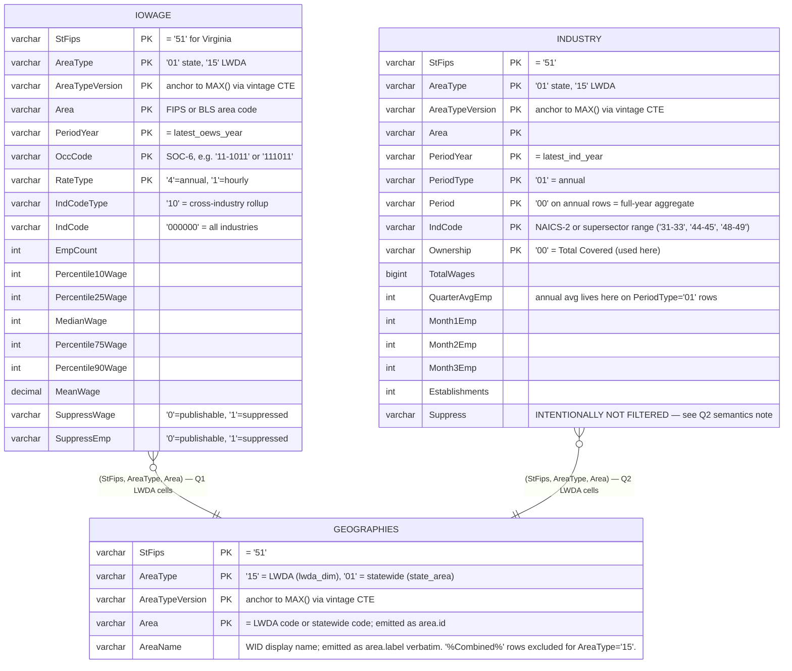
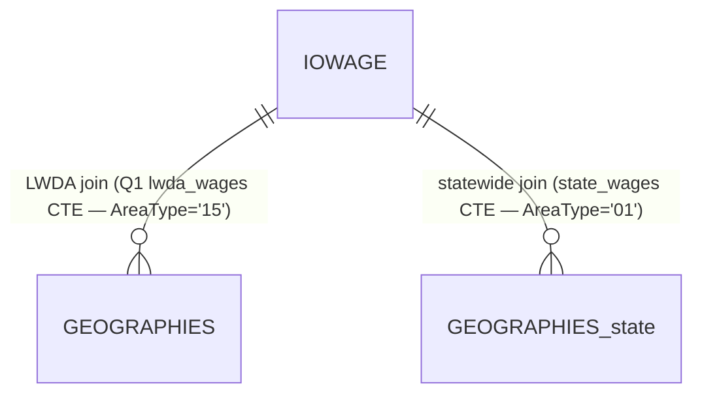
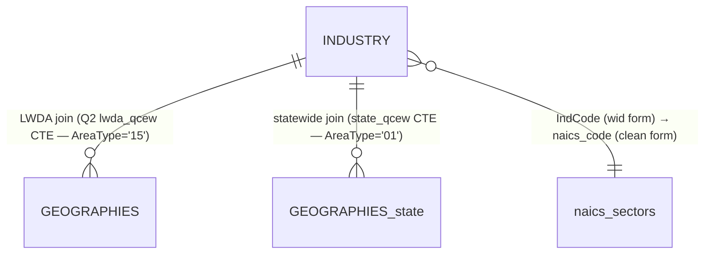

# Employer Wage Tool (Pay-Band Planner)

> **Living document.** Any change to the SQL in `queries/employer_wage_tool_mssql_RUN.sql` (or the `_validate.sql` companion) must be reflected here — especially the ERD join keys, the Validation Status table, and the unit-test SELECTs. Treat the Validation Status table as the source of truth for what has been verified against the live WID server.

---

## Part 1 — Overview

### What this tool does

The **Pay-Band Planner** is a self-service tool for Virginia employers building or benchmarking a wage offer. The user picks an **industry** (NAICS sector), a **job family** (SOC major group), a **region** (one of 14 LWDAs or "Virginia statewide"), and a **target percentile** (10–90, default 60). The tool returns:

- A **pay-band chart** showing the full p10–p90 wage distribution for every SOC-6 occupation in the chosen family, with the target percentile rendered as a vertical line on each bar.
- An **industry summary band** at the top showing mean wage, hourly equivalent, employment, and establishment count for the chosen NAICS × region cell.
- A **KPI strip** with the suggested budget range across the family, median market position, and total hiring pool size.

The tool replaces the spreadsheet workflow that VEC's employer outreach team historically maintained — the same OEWS percentile tables, but interactive, regionally aware, and tied to a refreshable data pipeline.

### Where the data comes from

All data flows out of the **WID 3.0 SQL Server** (Workforce Information Database, read-only Azure SQL Server instance hosted by VEC). The tool does **not** call the database at page load. A scheduled job runs the two SQL queries in `queries/employer_wage_tool_mssql_RUN.sql`, captures each `FOR JSON PATH` result as a static `.json` file, and deploys those files alongside the HTML/JS bundle.

```
WID 3.0 SQL Server   ──►  RUN.sql (2 queries)   ──►  2 JSON files       ──►  ECharts (browser)
(authoritative          (scheduled refresh,           wages.json              (renders the pay-band
 BLS source data)        read-only;                   industries.json          chart and KPIs)
                         _validate optional
                         schema check)
                                                  ──►  2 static lookups       (client-side label
                                                       soc-titles.json         enrichment, see
                                                       soc-aliases.json        Part 4 — Static lookups)
```

There is **no elevated setup step**. LWDA codes AND labels come live from `WID.dbo.GEOGRAPHIES` on every refresh (see Part 3). LWDA additions, retirements, and renames flow through automatically with zero manual edits.

This is the same JSON-on-disk architecture as the Front Page Dashboard, for the same reasons: load-time performance, public-facing resilience, and a refresh cadence decoupled from page traffic.

### Refresh cadence

| Source | Update frequency | Driving release |
|---|---|---|
| IOWAGE (Q1 → `wages.json`) | Annual | BLS OEWS release (~5 months after the reference year) |
| INDUSTRY (Q2 → `industries.json`) | Annual | BLS QCEW annual release (~5 months after year-end) |

Both queries refresh on the same scheduled job. The tool's `meta.latest_year` field reads from `wages.json` and is the year displayed on screen.

### User flow

```
1. Empty state          ──►  user picks Industry (NAICS supersector dropdown)
2. Industry chosen      ──►  Industry summary band populates
3. + Family chosen      ──►  Pay-band chart renders, all SOC-6 jobs in family
4. + Region (default    ──►  All bars + summary band switch to that region's
   = Virginia statewide)     OEWS / QCEW data
5. + Target percentile  ──►  Vertical "target" line on each bar moves; KPI
   slider (10..90)           strip shows the suggested budget range
```

The region default is "Virginia" (statewide). When the user picks an LWDA, the tool reads the corresponding cell from each SOC's `areas` keyed object. If the LWDA cell is suppressed (BLS confidentiality), the cell falls back to the statewide value with `provenance: "statewide_fallback"` — see [Provenance handling](#provenance-handling) below.

### Provenance handling

OEWS percentile rows are suppressed by BLS when the underlying sample is too thin for the (occupation, geography) cell. The SQL handles this at extract time by computing a 3-state provenance flag per cell:

| Provenance value | Meaning |
|---|---|
| `lwda` | Native LWDA cell — the OEWS sample was large enough that BLS published it. |
| `statewide_fallback` | LWDA cell was suppressed; we copied the statewide value as the best available substitute. The number is statewide, not LWDA-specific. |
| `statewide` | This row IS the statewide cell (only set on the `virginia` area row). |

The front-end renders the provenance flag as a hint in the chart tooltip so the user knows when they're looking at a fallback vs. a native LWDA cell. The percentile values themselves are not interpolated — they are exact copies of what BLS published.

---

## Part 2 — Visualizations

The tool is a single-page interactive composed of three rendered zones, all driven by the same two JSON files.

| Zone | Source JSON | Renders from |
|---|---|---|
| **Industry summary band** (top) | `industries.json` | `sectors[naics].areas[regionId].{mean_wage, employment, establishments}` |
| **Pay-band chart** (center) | `wages.json` | `jobs[soc].areas[regionId].{p10..p90, p10_h..p90_h, employment, provenance}` for every SOC-6 in the chosen family |
| **KPI strip** (above chart) | `wages.json` (computed in JS) | Aggregates across the family: target-percentile range, median range, hiring pool size |

There is no separate "trend over time" view — OEWS is annual point-in-time, not time series. Year-over-year comparison would require multi-year data emission (not currently in scope).

### Q1 — `wages.json` (OEWS percentile wages)

**SQL output shape:**
```json
{
  "meta": {
    "source": "WID.dbo.IOWAGE (T-SQL refresh)",
    "extracted_at": "2026-06-05T17:44:54.169Z",
    "latest_year": 2025
  },
  "areas": [
    // area.id = the 6-digit GEOGRAPHIES.Area code; label = GEOGRAPHIES.AreaName verbatim.
    // LWDA rows have areatype "15"; the statewide row has areatype "01".
    // The actual code values, label text, and ordering are whatever GEOGRAPHIES emits at refresh time.
    { "id": "000452", "label": "Alexandria/Arlington Region (LWDA XII)", "areatype": "15" },
    ...
    { "id": "<statewide-area-code>", "label": "Virginia", "areatype": "01" }
  ],
  "jobs": [
    {
      "id":          "11-1011",
      "soc_code":    "11-1011",
      "label":       "11-1011",                       // ← placeholder; SOC title patched client-side
      "major_group": "Management Occupations",
      "aliases":     [],                              // ← O*NET aliases (currently empty; see Part 4)
      "areas": {
        // Keys = the same lwda_code / statewide code from areas[].id above.
        "000452": {
          "p10": 149990,   "p25": 230910,  "p50": 359880,
          "p75": 514990,   "p90": 670100,
          "p10_h":  72.11, "p25_h": 111.02, "p50_h": 173.02,
          "p75_h": 247.59, "p90_h": 322.16,
          "employment": 530,
          "provenance": "lwda"
        },
        ...
        "<statewide-area-code>": {
          "p10": 88450, "p25": ..., "p50": ..., "p75": ..., "p90": ...,
          "p10_h": ..., "p25_h": ..., "p50_h": ..., "p75_h": ..., "p90_h": ...,
          "employment": 18430,
          "provenance": "statewide"
        }
      }
    },
    ...
  ]
}
```

> **Front-end contract.** `area.id` is the 6-digit `GEOGRAPHIES.Area` code (LWDA `lwda_code` for `areatype === '15'`; the statewide area code for `areatype === '01'`). The UI never reads a slug literal — the default-region picker finds statewide via `area.areatype === '01'`. The label rendered in the dropdown is `GEOGRAPHIES.AreaName` verbatim, including the "(LWDA …)" suffix. If a URL param exposes the selected region, the param value is the `lwda_code` (or statewide code), not a slug.

**Semantics:**
- Annual percentiles (`p10`..`p90`) are dollar amounts, integer-rounded.
- Hourly percentiles (`p10_h`..`p90_h`) are dollar amounts to 2 decimals (`DECIMAL(6,2)` in SQL). They are the OEWS-published hourly distribution, not annual / 2080.
- `employment` is the OEWS `EmpCount` for the (occupation, area) cell — used to size the hiring pool KPI.
- Top-code repair: BLS publishes `NULL` for p90 / p75 when the actual value exceeds the OEWS top-code threshold. The SQL applies a deterministic cap (`$239,200` annual / `$115.00` hourly) when the lower percentiles signal the cell is high-wage. This mirrors the v1 UI behavior — without it, high-wage management/medical SOCs would render with truncated bars.
- The `aliases` array is currently `[]` from SQL because the O*NET reference table is not yet loaded on this WID install — the front end soft-augments it from a separate static `soc-aliases.json` (see Part 4). The SQL has the alias-building CTE pre-written and commented out for the day WID exposes ONET_TITLES.

### Q2 — `industries.json` (QCEW industry summaries)

**SQL output shape:**
```json
{
  "meta": {
    "source": "WID.dbo.INDUSTRY (QCEW, T-SQL refresh)",
    "extracted_at": "2026-06-05T17:45:06.185Z",
    "latest_year": 2025
  },
  "areas": [
    // Same shape as wages.json — area.id is GEOGRAPHIES.Area, label is AreaName,
    // areatype distinguishes LWDA ('15') from statewide ('01').
    { "id": "000452", "label": "Alexandria/Arlington Region (LWDA XII)", "areatype": "15" },
    ...
    { "id": "<statewide-area-code>", "label": "Virginia", "areatype": "01" }
  ],
  "sectors": [
    {
      "naics": "11",
      "label": "Agriculture, Forestry, Fishing & Hunting",
      "areas": {
        // Keys = the lwda_code / statewide code, matching areas[].id above.
        "000452": { "mean_wage": 48235, "employment": 31,   "establishments": 7 },
        ...
        "<statewide-area-code>": { "mean_wage": 50912, "employment": 9842, "establishments": 1421 }
      }
    },
    ...
  ]
}
```

**Semantics:**
- `mean_wage` = `TotalWages / QuarterAvgEmp` on the annual aggregate row (`PeriodType='01' AND Period='00'`). This reproduces the BLS QCEW `AvgAnnualPay` methodology exactly. The derivation is needed because **this WID install does not expose the published `AvgAnnualPay` column** (a documented WID load gap — separate ticket).
- `employment` = `QuarterAvgEmp` on the annual aggregate row, with `(Month1Emp + Month2Emp + Month3Emp) / 3.0` as a fallback.
- `establishments` = `Establishments` count.
- All three values come from the BLS `Ownership='00'` (**Total Covered**) row, which is the sum of Federal (`'10'`) + State (`'20'`) + Local (`'30'`) + Private (`'50'`). **Do not** simultaneously filter on `'00'` and the four constituent codes — that double-counts.
- NAICS supersectors: 20 entries, covering all of NAICS 2-digit. **Three supersectors are stored as range strings** in the WID `IndCode` column — Manufacturing (`'31-33'`), Retail Trade (`'44-45'`), Transportation & Warehousing (`'48-49'`). The `naics_sectors` lookup CTE handles the mapping by storing both the WID-stored `wid_code` (used in the join) and the clean 2-digit `naics_code` (emitted to JSON).
- The Q2 query intentionally omits a `Suppress` filter. `INDUSTRY.Suppress='1'` covers ~66% of VA annual rows on this WID install — too broad to be BLS confidentiality. Values on flagged rows are populated and reconcile to statewide totals at 99.96% (per the `_validate.sql` diagnostic), suggesting the flag indicates imputation/quality rather than non-publishability. Revisit if WID load semantics are documented for this install.

---

## Part 3 — Data model (ERD)

The tool reads from **three** production WID 3.0 tables: `IOWAGE`, `INDUSTRY`, and `GEOGRAPHIES`. There is **no local seed table** and **no setup step** — LWDA codes AND labels both come live from `GEOGRAPHIES` on every refresh. LWDA additions, retirements, and renames flow through automatically with zero manual edits.

### Combined ERD — all tables and join keys

> **The 4-column geography join key** (StFips + AreaType + AreaTypeVersion + Area) is the canonical identity for any geographic row in WID. **`AreaTypeVersion` makes joins safe across BLS vintage rollovers** — without it, LWDA III's rename from "Western Virginia" (vintage 0000) to "Greater Roanoke Region" (vintage 0002) would silently corrupt joins. The Q1 + Q2 queries pin each fact table to its own `MAX(AreaTypeVersion)` via a vintage anchor CTE; the GEOGRAPHIES dimension is pinned to its own MAX independently. Fact and dimension vintages may legitimately differ — do not force them equal in joins.



**Join-key cheat sheet** (this is the most error-prone part of the codebase):

| Join | Composite key | Notes |
|---|---|---|
| `IOWAGE` ↔ `iowage_vintage` (anchor) | `(StFips, AreaType, AreaTypeVersion)` | Pins IOWAGE to its own `MAX(AreaTypeVersion)` per (StFips, AreaType) pair. |
| `GEOGRAPHIES` ↔ `geo_vintage` (anchor) | `(StFips, AreaType, AreaTypeVersion)` where `AreaType IN ('01','15')` | Pins GEOGRAPHIES to its own MAX per (StFips, AreaType), independently of IOWAGE/INDUSTRY. **May differ from the fact tables' vintages.** Covers AreaType `'01'` for the statewide row and `'15'` for LWDAs. |
| `INDUSTRY` ↔ `ind_vintage` (anchor) | `(StFips, AreaType, AreaTypeVersion)` | Same pattern as IOWAGE. |
| `IOWAGE` ↔ `lwda_dim` (Q1 LWDA cells) | `(StFips, AreaType, Area)` — **NOT** AreaTypeVersion | Vintages are pinned per table, joined on logical identity (StFips + AreaType + Area). Forcing AreaTypeVersion equality breaks rollovers. `lwda_dim` is built directly from GEOGRAPHIES at AreaType `'15'`. |
| `INDUSTRY` ↔ `lwda_dim` (Q2 LWDA cells) | `(StFips, AreaType, Area)` — **NOT** AreaTypeVersion | Same reason. |
| `state_area` CTE (built directly from GEOGRAPHIES at AreaType `'01'`) | (no further join) | Sources the statewide area code + label dynamically; no hardcoded `'virginia'` literal. |
| `INDUSTRY` ↔ `naics_sectors` (Q2 supersector lookup) | `INDUSTRY.IndCode = naics_sectors.wid_code` | `wid_code` is the WID-stored form (e.g. `'31-33'`); `naics_code` is the clean 2-digit form emitted to JSON. |

### Q1 call-out — `wages.json`



Filters applied:
- `StFips = '51'` (Virginia)
- `RateType IN ('1','4')` — `'4'` annual, `'1'` hourly, pivoted via conditional aggregation
- `IndCodeType = '10' AND IndCode = '000000'` — all-industries cross-industry row
- SOC-6 only: `LEN(REPLACE(LTRIM(RTRIM(OccCode)), '-', '')) = 6 AND RIGHT(...) <> '0'` (exclude BLS major-group aggregates which end in `0`)
- `SuppressWage = '0'` and `SuppressEmp = '0'` inside each conditional aggregate (so suppressed cells contribute `NULL`)
- Statewide-fallback logic: any (SOC, LWDA) cell where the LWDA `p50` is `NULL` after aggregation gets the statewide values copied in, with `provenance = 'statewide_fallback'`.

### Q2 call-out — `industries.json`



Filters applied:
- `StFips = '51'`, `PeriodType = '01'`, `Period = '00'` (annual full-year aggregate)
- `Ownership = '00'` (BLS Total Covered row — already sums Federal + State + Local + Private)
- `IndCode` joined to the 20-row `naics_sectors` lookup. Joining on `IndCode` directly would silently drop Manufacturing / Retail / Transportation because of the hyphen-range storage format.

### LWDA tiling guarantee

The set of LWDAs is **inferred live from GEOGRAPHIES** at `AreaType='15'` after filtering `AreaName NOT LIKE '%Combined%'`. There is no hand-curated list to maintain. As a side effect, certain WID rows that look like LWDAs are filtered automatically:

- **`000491` — "Combined Projections Area (LWDA XI and XII)"**: a BLS-projections-only synthetic area aggregating Northern (`000451`) + Alexandria/Arlington (`000452`) for forecast modeling. It has no county membership in `SUBGEOGRAPHIES` — counties in that territory roll up directly to `000451` or `000452`. The `%Combined%` filter catches it; if a future vintage adds a new combined-projections supersector, the same filter catches it without code changes.
- **`000454` — "Greater Peninsula"**: a legacy LWDA boundary retired in an earlier vintage. The six localities formerly under Greater Peninsula — **York County, Hampton city, Newport News city, Poquoson city, Williamsburg city, James City County** — now all roll up to **Hampton Roads (`000456`)** in the current production vintage (`'0002'`). Verified against the 133-county SUBGEOGRAPHIES-derived roll-up shipped in the Front Page Dashboard's `employment_by_locality.json`: all six formerly-Peninsula localities carry `region = "000456"`, and the code `000454` appears in no county's `region` field. If BLS resurrects `000454` in a future vintage with its own AreaName (not matching `%Combined%`), the tool will pick it up automatically — verify the new tiling via [Smoke Test 7](#smoke-test-7-lwda-tiling-partition-check) before shipping.

**Coverage guarantee:** The LWDAs returned by the live `lwda_dim` CTE are expected to fully tile Virginia — every county / independent city in `SUBGEOGRAPHIES` (`AreaType='15'`, `SubAreaType='04'`) maps to exactly one of them, with no gaps and no double-homing. If this guarantee breaks (e.g. a new LWDA appears in GEOGRAPHIES but isn't reachable from SUBGEOGRAPHIES, or boundary overlaps appear during a vintage transition), the per-LWDA employment totals in `industries.json` and `wages.json` will drift **uniformly low** against the statewide row. The dedicated catch is [Smoke Test 7](#smoke-test-7-lwda-tiling-partition-check); the symptom it disambiguates is described in the Recon 2 failure-mode notes.

---

## Part 4 — Static lookups

Two additional JSON files ship with the tool but are **not** SQL-generated:

| File | Purpose | What happens if missing |
|---|---|---|
| `data/soc-titles.json` | SOC-6 → human occupation title, derived from the BLS SOC structure. WID 3.0 on this install does not expose `OccName` on `IOWAGE`. | Job labels fall back to the SOC code (`"11-1011"` instead of `"Chief Executives"`). Tool remains usable. |
| `data/soc-aliases.json` | SOC-6 → array of O*NET alternate titles, e.g. `"Registered Nurse"` aliases including `"RN"`, `"Nurse Practitioner"`. Powers the family dropdown's alias-aware search. | Family dropdown falls back to literal-text search. Tool remains usable. |

Both are loaded via `fetch(...).then(r => r.ok ? r.json() : {}).catch(() => ({}))` — i.e. soft-fail. They are not blockers for refresh, and they are not part of the SQL pipeline. When/if WID 3.0 starts exposing `OccName` on `IOWAGE` and `ONET_TITLES` as a separate dimension table, both lookups become SQL-emittable and the pre-commented CTE blocks in `_RUN.sql` (lines 309–332) can be uncommented to ship aliases natively.

These two files do not need to be regenerated on every refresh — they only change when BLS releases a new SOC vintage (rare, ~5 year cycle) or when new O*NET alt titles are published.

---

## Part 5 — Technical reference

### WID 3.0 conventions

| Convention | Detail |
|---|---|
| Schema | `WID.dbo.*` — production tables only. **No local seed tables.** |
| State filter | `StFips = '51'` for Virginia, always-quoted string |
| AreaType codes | `'01'` state, `'15'` LWDA (the tool does **not** read county-level rows) |
| AreaTypeVersion | Each table's vintage is independent; anchor via `MAX(AreaTypeVersion) GROUP BY (StFips, AreaType)` in a CTE. Fact and GEOGRAPHIES vintages may legitimately differ — pin each independently. |
| Read-only | The scheduled `_RUN.sql` job account has only `SELECT` rights. There is no elevated setup step — labels and codes come live from `GEOGRAPHIES` on every refresh. |
| Min version | SQL Server 2017+ for `STRING_AGG`; 2016+ for `FOR JSON PATH`. Azure SQL (the prod host) satisfies both. |

### High-variance columns

Renaming any of these in SQL = silent wrong numbers (no error). Confirm via `_validate.sql` Probe 1.

- **IOWAGE percentiles** are named `Percentile10Wage` / `Percentile25Wage` / `MedianWage` / `Percentile75Wage` / `Percentile90Wage` in this WID install. BLS-variant installs sometimes name them `A_PCT10` / `ANNUAL_PCT10_WAGE` / `AnnWage10`. Wrong column name = silent wrong numbers.
- **IOWAGE.RateType** values are `'4'` (annual, ~$67K median) and `'1'` (hourly, ~$32 median). Confirm via `_validate.sql` Probe 4. Wrong code = entire pivot collapses to NULL.
- **INDUSTRY.QuarterAvgEmp** is the source of truth for annual-average employment on `PeriodType='01' Period='00'` rows. The `(Month1Emp + Month2Emp + Month3Emp) / 3.0` form is the documented fallback — used only if `QuarterAvgEmp` is `NULL`.
- **INDUSTRY.Establishments** — confirm via Probe 1. Some BLS variants name this `AnnualAvgEst` or `QtrlyEstabs`.

### Known WID 3.0 load gaps on this install

These are documented gaps where this WID install lacks columns the BLS WID 3.0 spec defines. Track separately as load-gap tickets to the WID owner — not workarounds to bake in permanently.

| Spec column | Status here | Workaround in this pipeline |
|---|---|---|
| `IOWAGE.OccName` | Missing | SOC code is used as the label placeholder; `data/soc-titles.json` is applied client-side at render time. |
| `INDUSTRY.AvgAnnualPay` | Missing | Computed inline as `TotalWages / NULLIF(QuarterAvgEmp, 0)` (matches BLS published methodology). |
| `WID.dbo.ONET_TITLES` | Likely missing (probe 5 confirms) | `aliases` field emits `[]`; `data/soc-aliases.json` is applied client-side. The CTE for the live form is pre-written and commented in `_RUN.sql:309-332`. |

### Why JSON-on-disk instead of live SQL

Same rationale as the Front Page Dashboard:
- Public-facing tool — page load is the user-experience constraint.
- WID server is internal and not built for public traffic.
- Refresh cadence (annual) is far slower than employer outreach cycles — there is no business case for sub-second freshness.
- A failed refresh produces stale-but-correct data, not an outage.

### Validation Status

Each row marks whether an assumption has been **Confirmed** against the live WID server or is **Assumed (pending validation)**. Update this table whenever you re-run `_validate.sql` or spot-check the production output.

| # | Assumption | Status | Source of confirmation |
|---|---|---|---|
| 1 | `IOWAGE` exposes `Percentile10Wage`, `Percentile25Wage`, `MedianWage`, `Percentile75Wage`, `Percentile90Wage`, `MeanWage`, `EmpCount`, `RateType`, `OccCode`, `IndCode`, `IndCodeType`, `SuppressWage`, `SuppressEmp` | **Confirmed** | `_validate.sql` Probe 1, 2026-06-04 (header marker in `_RUN.sql:41–43`). |
| 2 | `IOWAGE.OccName` is **missing** | **Confirmed** | Same probe. Documented load gap. |
| 3 | `IOWAGE.RateType` values: `'4'` = Annual (~$67K median), `'1'` = Hourly (~$32 median) | **Confirmed** | `_validate.sql` Probe 4, 2026-06-04. |
| 4 | `IOWAGE.AreaType = '15'` for LWDAs | **Confirmed** | `_validate.sql` Probe 2 + Probe 3, 2026-06-04. |
| 5 | OEWS published at LWDA granularity (Probe 3 returned non-zero rows for `AreaType='15'`) | **Confirmed** | `_validate.sql` Probe 3, 2026-06-04. If a future refresh shows zero LWDA rows, every cell falls back to statewide — still valid output, but worth flagging in the UI. |
| 6 | `IOWAGE` stores SOC codes as 6 digits with hyphen optional (e.g. `'111011'` or `'11-1011'`) — the `REPLACE(..., '-', '')` normalization handles both forms | **Assumed — pending validation** | Defensive normalization; never been seen failing, but not separately probed. Run [Smoke Test 4 — SOC code format](#smoke-test-4-soc-code-format-in-iowage). |
| 7 | `INDUSTRY` exposes `TotalWages`, `QuarterAvgEmp`, `Establishments`, `Month1Emp`, `Month2Emp`, `Month3Emp`, `IndCode`, `Ownership`, `Suppress` | **Confirmed** | `_validate.sql` Probe 1, 2026-06-04. |
| 8 | `INDUSTRY.AvgAnnualPay` is **missing** (BLS spec column not loaded) | **Confirmed** | Probe 1 + `_RUN.sql:60–64` header note. Documented load gap. |
| 9 | `INDUSTRY.Ownership = '00'` is the BLS Total Covered row, equal to sum of `'10'+'20'+'30'+'50'` | **Confirmed** | `_validate.sql` Probe 4 + value reconciliation, 2026-06-04. |
| 10 | `INDUSTRY.PeriodType = '01'` annual, `Period = '00'` on annual rows = full-year aggregate | **Confirmed** | `_validate.sql` Probe 4, 2026-06-04. |
| 11 | NAICS supersectors are stored as range strings in `IndCode` — `'31-33'`, `'44-45'`, `'48-49'` (the other 17 are single 2-digit codes) | **Confirmed** | Spot-checked against `_RUN.sql:519–528` header note; resulting `industries.json` has all 20 sectors populated, confirming the join works. |
| 12 | `INDUSTRY.Suppress = '1'` covers ~66% of VA annual rows, with populated values reconciling to statewide totals at 99.96% — i.e. the flag indicates imputation/quality, not non-publishability | **Confirmed (architectural decision)** | `_validate.sql` diagnostic + `_RUN.sql:582–587` comment. The Q2 query intentionally does **not** filter on `Suppress`. Revisit if WID load semantics are documented for this install. |
| 13 | Fact tables (IOWAGE / INDUSTRY) and the GEOGRAPHIES dimension may carry **different** `AreaTypeVersion` values. Vintages should be pinned independently and joined on `(StFips, AreaType, Area)` only — not on `AreaTypeVersion`. | **Confirmed (architectural decision)** | Established pattern in `_RUN.sql:222–227` (with explicit inline comment). |
| 14 | LWDA codes AND labels resolved live from `WID.dbo.GEOGRAPHIES` at `AreaType='15'` (with `AreaName NOT LIKE '%Combined%'`). No seed table. Same pattern for the statewide row at `AreaType='01'`. | **Confirmed (architectural decision)** | `_RUN.sql` `lwda_dim` + `state_area` CTEs. Validated by [Smoke Test 7 — LWDA tiling partition check](#smoke-test-7-lwda-tiling-partition-check) on every refresh. Future LWDA changes (additions, retirements, renames) flow through automatically. |
| 15 | `WID.dbo.ONET_TITLES` may exist (BLS WID 3.0 spec includes it) but probe was not formally run | **Assumed — pending validation** | Run [Smoke Test 6 — ONET_TITLES presence](#smoke-test-6-onet_titles-presence). If present, the CTE in `_RUN.sql:309–332` can be uncommented and `soc-aliases.json` static lookup retired. |
| 16 | Top-code repair thresholds (`$239,200` annual, `$115.00` hourly) match what the UI v1 used | **Confirmed (architectural decision)** | These are the documented OEWS top-codes for the relevant reference year. If BLS changes them, this constant moves with the SQL — flag any change here. |

---

## Part 6 — Unit-test validation SQL

Run these SELECT statements directly in SQL Server Management Studio (SSMS) or Azure Data Studio against the WID server. All queries are read-only.

> **Anchor your expectations.** All hard-coded expected values in this section are anchored to the **2026-06-05 WID extract** (current production JSON deploy, `latest_year = 2025`). After any annual refresh, expected values for `latest_year`, `mean_wage`, percentile values, etc. will advance. A "fail" is when the *shape* changes (column count, distinct LWDA count, sector count, etc.) — not when the dollar amounts move.

### Tier 1 — Sanity counts

#### Smoke Test 1: Column inventory
Confirms all expected columns exist on the source tables. Resolves Validation Status rows **#1, #2, #7, #8**.

```sql
-- EXPECT: rows for every column listed in the ERD. Missing columns = the
-- query in _RUN.sql will fail or silently return wrong numbers.
SELECT TABLE_NAME, COLUMN_NAME, DATA_TYPE, CHARACTER_MAXIMUM_LENGTH
FROM WID.INFORMATION_SCHEMA.COLUMNS
WHERE TABLE_NAME IN ('IOWAGE','INDUSTRY','GEOGRAPHIES','ONET_TITLES')
ORDER BY TABLE_NAME, ORDINAL_POSITION;
```

#### Smoke Test 2: LWDA dimension sanity (replaces the retired LWDA_Slugs seed-integrity check)
The seed-integrity check from prior versions has been retired — there is no seed table to validate. This replacement confirms that the live `lwda_dim` CTE (used by `_RUN.sql` and Smoke Test 7) returns a sane LWDA list with non-NULL labels and an excluded-Combined count of zero.

```sql
-- EXPECT (anchored to the 2026-06-05 extract, GEOGRAPHIES vintage '0002'):
--   active_lwda_count          = 14
--   combined_filtered_count    = 1 (the '000491' Combined Projections Area)
--   null_or_empty_labels       = 0
--   null_or_empty_codes        = 0
-- A drift in active_lwda_count means BLS added or retired an LWDA in this
-- vintage. Re-run Smoke Test 7 to confirm the new set still tiles VA, then
-- re-deploy the JSON. No SQL edits required.
WITH geo_vintage AS (
    SELECT StFips, AreaType, MAX(AreaTypeVersion) AS AreaTypeVersion
    FROM WID.dbo.GEOGRAPHIES
    WHERE StFips = '51' AND AreaType = '15'
    GROUP BY StFips, AreaType
)
SELECT
    SUM(CASE WHEN g.AreaName NOT LIKE '%Combined%' THEN 1 ELSE 0 END) AS active_lwda_count,
    SUM(CASE WHEN g.AreaName     LIKE '%Combined%' THEN 1 ELSE 0 END) AS combined_filtered_count,
    SUM(CASE WHEN g.AreaName NOT LIKE '%Combined%'
              AND (g.AreaName IS NULL OR g.AreaName = '') THEN 1 ELSE 0 END) AS null_or_empty_labels,
    SUM(CASE WHEN g.Area IS NULL OR g.Area = '' THEN 1 ELSE 0 END) AS null_or_empty_codes
FROM WID.dbo.GEOGRAPHIES g
JOIN geo_vintage gv
  ON g.StFips = gv.StFips AND g.AreaType = gv.AreaType
 AND g.AreaTypeVersion = gv.AreaTypeVersion
WHERE g.StFips = '51' AND g.AreaType = '15';
```

#### Smoke Test 3: IOWAGE rate-type pivot will work
Resolves Validation Status row **#3**.
```sql
-- EXPECT (anchored to 2026-06-05 extract):
--   RateType '1' (Hourly):  large count, MIN(MedianWage)  ≈ $10-15, MAX ≈ $100+
--   RateType '4' (Annual):  large count, MIN(MedianWage)  ≈ $25-30K, MAX ≈ $200K+
--   Any other RateType value present = a new code BLS introduced; the pivot
--   will silently emit NULL for those occupations.
SELECT
    RateType,
    COUNT(*)                     AS row_count,
    MIN(TRY_CAST(MedianWage AS DECIMAL(12,2))) AS min_median,
    MAX(TRY_CAST(MedianWage AS DECIMAL(12,2))) AS max_median
FROM WID.dbo.IOWAGE
WHERE StFips = '51'
GROUP BY RateType
ORDER BY RateType;
```

#### Smoke Test 4: SOC code format in IOWAGE
Resolves Validation Status row **#6**.
```sql
-- EXPECT (anchored to 2026-06-05 extract):
--   exactly one of (hyphenated, unhyphenated) is the dominant form;
--   the REPLACE(..., '-', '') normalization tolerates either.
--   If both forms are present in non-trivial counts, double-counting risk.
SELECT
    CASE WHEN CHARINDEX('-', OccCode) > 0 THEN 'hyphenated (XX-XXXX)'
         ELSE 'unhyphenated (XXXXXX)'
    END AS soc_format,
    COUNT(*) AS row_count,
    MIN(OccCode) AS sample_low,
    MAX(OccCode) AS sample_high
FROM WID.dbo.IOWAGE
WHERE StFips = '51'
GROUP BY CASE WHEN CHARINDEX('-', OccCode) > 0 THEN 'hyphenated (XX-XXXX)' ELSE 'unhyphenated (XXXXXX)' END;
```

#### Smoke Test 5: NAICS supersector coverage in INDUSTRY
Confirms Validation Status row **#11** still holds after refresh.
```sql
-- EXPECT (anchored to 2026-06-05 extract):
--   20 distinct supersector codes (matches the 20-row naics_sectors lookup)
--   Includes the three range strings: '31-33', '44-45', '48-49'.
SELECT
    LTRIM(RTRIM(IndCode)) AS ind_code,
    COUNT(*) AS row_count
FROM WID.dbo.INDUSTRY
WHERE StFips = '51'
  AND AreaType = '01'
  AND PeriodType = '01' AND Period = '00'
  AND Ownership = '00'
  AND LTRIM(RTRIM(IndCode)) IN (
      '11','21','22','23','31-33','42','44-45','48-49',
      '51','52','53','54','55','56','61','62','71','72','81','92'
  )
GROUP BY LTRIM(RTRIM(IndCode))
ORDER BY ind_code;
```

#### Smoke Test 6: ONET_TITLES presence
Resolves Validation Status row **#15**.

> **Gate on Smoke Test 1 — do not run this blind.** A direct `SELECT FROM WID.dbo.ONET_TITLES` errors with Msg 208 (`Invalid object name`) if the table is absent, which is noise that confuses the operator. Smoke Test 1 already surfaces presence safely via `INFORMATION_SCHEMA.COLUMNS`: if Test 1 returns **no** rows for `TABLE_NAME = 'ONET_TITLES'`, the table is not loaded — **skip Smoke Test 6** and mark Validation Status row #15 as Confirmed-missing (the `soc-aliases.json` static lookup remains the answer). Only run the query below when Test 1 confirmed `ONET_TITLES` rows.

```sql
-- EXPECT (only run if Smoke Test 1 returned ONET_TITLES columns):
--   A sample row showing ONETSOC_CODE format (8 chars, e.g. '11-1011.00')
--   + a non-null ALTERNATE_TITLE column.
SELECT TOP 5 *
FROM WID.dbo.ONET_TITLES;
```

#### Smoke Test 7: LWDA tiling partition check
Resolves the **Coverage guarantee** stated in Part 3. Confirms that the LWDAs returned by the live `lwda_dim` CTE (= `GEOGRAPHIES` at `AreaType='15'` with `AreaName NOT LIKE '%Combined%'`) fully tile Virginia — every county / independent city in `SUBGEOGRAPHIES` maps to exactly one active LWDA, with no gap (orphaned county) and no double-homing (county claimed by two LWDAs).

The check **reads membership directly from `GEOGRAPHIES` against `SUBGEOGRAPHIES`** — there is no seed table to consult and no list to keep in sync.
```sql
-- EXPECT (anchored to the 2026-06-05 extract, GEOGRAPHIES vintage '0002'):
--   counties_total              = 133
--   counties_mapped_to_active   = 133
--   counties_double_homed       = 0
--   counties_orphaned           = 0
--
-- Failure modes:
--   * counties_orphaned > 0      → a county in SUBGEOGRAPHIES rolls up to
--                                  an LWDA code that the lwda_dim CTE has
--                                  excluded. Most likely cause: the
--                                  GEOGRAPHIES row for that LWDA code has
--                                  an AreaName starting with "Combined"
--                                  (the lwda_dim filter excludes those),
--                                  or the LWDA row is absent from
--                                  GEOGRAPHIES entirely (a vintage-anchor
--                                  mismatch between SUBGEOGRAPHIES and
--                                  GEOGRAPHIES).
--                                  Resolution: run the DIAGNOSTIC query
--                                  below to see the orphan + reason.
--                                  Code change: usually none — the
--                                  AreaName filter is the safety net.
--   * counties_double_homed > 0  → a county appears under multiple active
--                                  LWDAs in SUBGEOGRAPHIES at the same
--                                  vintage. Only happens if SUBGEOGRAPHIES
--                                  carries overlapping boundary rows.
--                                  Resolution: re-check the sg_vintage
--                                  anchor and the SUBGEOGRAPHIES load.
--
-- This check is the disambiguator for Recon 2: a uniform sub-1.0 shortfall
-- on Recon 2 with this check PASSING points to vintage drift on the
-- INDUSTRY side; the same shortfall with this check FAILING points to a
-- tiling/coverage gap. Run both whenever Recon 2 drifts uniformly low.
WITH sg_vintage AS (
    SELECT StFips, AreaType, MAX(AreaTypeVersion) AS AreaTypeVersion
    FROM WID.dbo.SUBGEOGRAPHIES
    WHERE StFips = '51' AND AreaType = '15'
    GROUP BY StFips, AreaType
),
geo_vintage AS (
    SELECT StFips, AreaType, MAX(AreaTypeVersion) AS AreaTypeVersion
    FROM WID.dbo.GEOGRAPHIES
    WHERE StFips = '51' AND AreaType = '15'
    GROUP BY StFips, AreaType
),
lwda_dim_live AS (
    -- Mirrors lwda_dim in _RUN.sql exactly — the source of truth for which
    -- LWDA codes are "active" in this refresh.
    SELECT g.Area AS lwda_code
    FROM WID.dbo.GEOGRAPHIES g
    JOIN geo_vintage gv
      ON g.StFips = gv.StFips AND g.AreaType = gv.AreaType
     AND g.AreaTypeVersion = gv.AreaTypeVersion
    WHERE g.StFips = '51' AND g.AreaType = '15'
      AND g.AreaName NOT LIKE '%Combined%'
),
county_to_lwda AS (
    SELECT
        sg.SubArea                                            AS county_code,
        sg.Area                                               AS lwda_code,
        CASE WHEN ld.lwda_code IS NOT NULL THEN 1 ELSE 0 END  AS is_active
    FROM WID.dbo.SUBGEOGRAPHIES sg
    JOIN sg_vintage sgv
      ON sg.StFips = sgv.StFips AND sg.AreaType = sgv.AreaType
     AND sg.AreaTypeVersion = sgv.AreaTypeVersion
    LEFT JOIN lwda_dim_live ld
      ON ld.lwda_code = sg.Area
    WHERE sg.StFips = '51' AND sg.AreaType = '15' AND sg.SubAreaType = '04'
),
county_homes AS (
    SELECT county_code, SUM(is_active) AS active_homes
    FROM county_to_lwda
    GROUP BY county_code
)
SELECT
    COUNT(*)                                            AS counties_total,
    SUM(CASE WHEN active_homes >= 1 THEN 1 ELSE 0 END)  AS counties_mapped_to_active,
    SUM(CASE WHEN active_homes  > 1 THEN 1 ELSE 0 END)  AS counties_double_homed,
    SUM(CASE WHEN active_homes  = 0 THEN 1 ELSE 0 END)  AS counties_orphaned
FROM county_homes;
```

For diagnostic detail when the partition check fails, run this companion query — it returns every county whose LWDA assignment is excluded from `lwda_dim`, plus the reason for the exclusion (Combined-filtered vs. absent from GEOGRAPHIES):
```sql
-- DIAGNOSTIC: list orphaned counties + the unseeded LWDA + reason.
-- Run only when Smoke Test 7 reports counties_orphaned > 0.
WITH sg_vintage AS (
    SELECT StFips, AreaType, MAX(AreaTypeVersion) AS AreaTypeVersion
    FROM WID.dbo.SUBGEOGRAPHIES
    WHERE StFips = '51' AND AreaType = '15'
    GROUP BY StFips, AreaType
),
geo_vintage AS (
    SELECT StFips, AreaType, MAX(AreaTypeVersion) AS AreaTypeVersion
    FROM WID.dbo.GEOGRAPHIES
    WHERE StFips = '51' AND AreaType IN ('04','15')
    GROUP BY StFips, AreaType
),
lwda_dim_live AS (
    SELECT g.Area AS lwda_code
    FROM WID.dbo.GEOGRAPHIES g
    JOIN geo_vintage gv
      ON g.StFips = gv.StFips AND g.AreaType = gv.AreaType
     AND g.AreaTypeVersion = gv.AreaTypeVersion
    WHERE g.StFips = '51' AND g.AreaType = '15'
      AND g.AreaName NOT LIKE '%Combined%'
)
SELECT
    sg.SubArea                  AS county_code,
    gc.AreaName                 AS county_name,
    sg.Area                     AS orphan_lwda_code,
    gl.AreaName                 AS orphan_lwda_name,
    CASE
        WHEN gl.AreaName LIKE '%Combined%'  THEN 'Excluded by lwda_dim %Combined% filter (expected)'
        WHEN gl.AreaName IS NULL            THEN 'LWDA code present in SUBGEOGRAPHIES but absent from GEOGRAPHIES at current vintage'
        ELSE 'Present in GEOGRAPHIES but excluded for an unknown reason — investigate lwda_dim filter'
    END                         AS exclusion_reason
FROM WID.dbo.SUBGEOGRAPHIES sg
JOIN sg_vintage sgv
  ON sg.StFips = sgv.StFips AND sg.AreaType = sgv.AreaType
 AND sg.AreaTypeVersion = sgv.AreaTypeVersion
LEFT JOIN lwda_dim_live ld
  ON ld.lwda_code = sg.Area
LEFT JOIN WID.dbo.GEOGRAPHIES gc
  ON gc.StFips = '51' AND gc.AreaType = '04' AND gc.Area = sg.SubArea
LEFT JOIN geo_vintage gcv
  ON gcv.StFips = gc.StFips AND gcv.AreaType = gc.AreaType
 AND gcv.AreaTypeVersion = gc.AreaTypeVersion
LEFT JOIN WID.dbo.GEOGRAPHIES gl
  ON gl.StFips = '51' AND gl.AreaType = '15' AND gl.Area = sg.Area
WHERE sg.StFips = '51' AND sg.AreaType = '15' AND sg.SubAreaType = '04'
  AND ld.lwda_code IS NULL
ORDER BY sg.Area, sg.SubArea;
```

### Tier 2 — Spot-checks (anchored to 2026-06-05 extract)

#### Spot-check A — Software Developers (15-1252) statewide annual wages
```sql
-- EXPECT (anchored to the 2026-06-05 extract, OEWS reference year 2025):
--   p10 ≈ $73-80K, p50 ≈ $124-132K, p90 ≈ $200K+
-- These are derived from the Virginia row of jobs[15-1252].areas.virginia
-- in wages.json. Update these expected ranges when the JSON refreshes.
SELECT
    REPLACE(OccCode, '-', '') AS soc_code_normalized,
    RateType,
    TRY_CAST(Percentile10Wage AS INT)  AS p10,
    TRY_CAST(Percentile25Wage AS INT)  AS p25,
    TRY_CAST(MedianWage       AS INT)  AS p50,
    TRY_CAST(Percentile75Wage AS INT)  AS p75,
    TRY_CAST(Percentile90Wage AS INT)  AS p90,
    TRY_CAST(EmpCount         AS INT)  AS employment
FROM WID.dbo.IOWAGE w
WHERE w.StFips = '51' AND w.AreaType = '01'
  AND w.PeriodYear = (
      SELECT MAX(PeriodYear) FROM WID.dbo.IOWAGE WHERE StFips = '51' AND AreaType = '01'
  )
  AND w.IndCodeType = '10' AND w.IndCode = '000000'
  AND REPLACE(w.OccCode, '-', '') = '151252'   -- Software Developers
  AND w.RateType = '4'                          -- annual
  AND w.SuppressWage = '0';
```

#### Spot-check B — Northern LWDA Software Developers (regional wage premium)
```sql
-- EXPECT (anchored to the 2026-06-05 extract):
--   Northern LWDA (code '000451') median annual ≈ 1.10-1.25× of statewide
--   (NoVA labor market commands a premium). A ratio < 0.9 OR > 1.5 suggests
--   either a join breakage or a vintage misalignment.
SELECT
    g.AreaName,
    TRY_CAST(w.MedianWage AS INT) AS median_annual,
    TRY_CAST(w.EmpCount   AS INT) AS employment
FROM WID.dbo.IOWAGE w
JOIN WID.dbo.GEOGRAPHIES g
  ON g.StFips = w.StFips AND g.AreaType = w.AreaType AND g.Area = w.Area
WHERE w.StFips = '51' AND w.AreaType = '15'
  AND g.Area = '000451'                          -- Northern
  AND w.PeriodYear = (
      SELECT MAX(PeriodYear) FROM WID.dbo.IOWAGE WHERE StFips = '51' AND AreaType = '15'
  )
  AND w.IndCodeType = '10' AND w.IndCode = '000000'
  AND REPLACE(w.OccCode, '-', '') = '151252'
  AND w.RateType = '4'
  AND w.SuppressWage = '0';
```

#### Spot-check C — Manufacturing (NAICS 31-33) statewide industry summary
```sql
-- EXPECT (anchored to the 2026-06-05 extract, QCEW reference year 2025):
--   mean_wage     ≈ $68-78K
--   employment    ≈ 240-260K
--   establishments ≈ 5,000-6,000
-- Update these expected ranges when the JSON refreshes.
SELECT
    LTRIM(RTRIM(i.IndCode))                                         AS wid_ind_code,
    TRY_CAST(i.TotalWages / NULLIF(i.QuarterAvgEmp, 0) AS INT)       AS mean_wage,
    TRY_CAST(i.QuarterAvgEmp                          AS INT)        AS employment,
    TRY_CAST(i.Establishments                         AS INT)        AS establishments
FROM WID.dbo.INDUSTRY i
WHERE i.StFips = '51' AND i.AreaType = '01'
  AND i.PeriodYear = (
      SELECT MAX(PeriodYear) FROM WID.dbo.INDUSTRY
      WHERE StFips = '51' AND AreaType = '01'
        AND PeriodType = '01' AND Period = '00'
  )
  AND i.PeriodType = '01' AND i.Period = '00'
  AND i.Ownership = '00'
  AND LTRIM(RTRIM(i.IndCode)) = '31-33';            -- Manufacturing
```

### Tier 3 — Reconciliation

> The reconciliation tier is the most important check after a refresh. It catches **AreaTypeVersion vintage double-counting**, which is the failure mode the per-table vintage anchor pattern guards against. If the vintage anchors are silently misaligned (e.g. two IOWAGE vintages stacked), the sum across LWDAs will be ≈ 2× the statewide total — and the per-region percentiles will still look plausible.

#### Recon 1 — IOWAGE: sum of LWDA employment ≈ statewide employment (per SOC)
```sql
-- EXPECT (anchored to the 2026-06-05 extract):
--   For each high-employment SOC: sum_lwda_emp ≈ statewide_emp ± 15%
--   (slack accounts for legitimate LWDA suppression of cells with thin
--   samples that statewide nets out).
--   A ratio > 1.5 = vintage double-counting. < 0.5 = systemic suppression
--   or a missing LWDA row in the join.
WITH iv AS (
    SELECT StFips, AreaType, MAX(AreaTypeVersion) AS AreaTypeVersion
    FROM WID.dbo.IOWAGE WHERE StFips='51' GROUP BY StFips, AreaType
),
ly AS (
    SELECT MAX(PeriodYear) AS yr FROM WID.dbo.IOWAGE w
    JOIN iv ON w.StFips=iv.StFips AND w.AreaType=iv.AreaType AND w.AreaTypeVersion=iv.AreaTypeVersion
    WHERE w.StFips='51' AND w.AreaType='01'
)
SELECT
    REPLACE(w.OccCode, '-', '') AS soc_code,
    SUM(CASE WHEN w.AreaType='15' THEN TRY_CAST(w.EmpCount AS INT) END) AS sum_lwda_emp,
    SUM(CASE WHEN w.AreaType='01' THEN TRY_CAST(w.EmpCount AS INT) END) AS statewide_emp,
    CAST(SUM(CASE WHEN w.AreaType='15' THEN TRY_CAST(w.EmpCount AS INT) END) * 1.0
       / NULLIF(SUM(CASE WHEN w.AreaType='01' THEN TRY_CAST(w.EmpCount AS INT) END), 0)
       AS DECIMAL(5,3)) AS ratio_should_be_0_85_to_1_15
FROM WID.dbo.IOWAGE w
JOIN iv ON w.StFips=iv.StFips AND w.AreaType=iv.AreaType AND w.AreaTypeVersion=iv.AreaTypeVersion
CROSS JOIN ly
WHERE w.StFips='51' AND w.AreaType IN ('01','15')
  AND w.PeriodYear = ly.yr
  AND w.RateType = '4'
  AND w.IndCodeType = '10' AND w.IndCode = '000000'
  AND w.SuppressEmp = '0'
  AND REPLACE(w.OccCode, '-', '') IN (
      '151252',   -- Software Developers (large, urban-concentrated)
      '291141',   -- Registered Nurses    (large, broadly distributed)
      '412031',   -- Retail Salespersons  (large, broadly distributed)
      '533032'    -- Heavy Truck Drivers  (large, broadly distributed)
  )
GROUP BY REPLACE(w.OccCode, '-', '')
ORDER BY soc_code;
```

#### Recon 2 — INDUSTRY: sum of per-LWDA employment ≈ statewide employment (per NAICS)
```sql
-- EXPECT (anchored to the 2026-06-05 extract):
--   For each NAICS supersector: sum_lwda_emp ≈ statewide_emp, ratio ∈ [0.95, 1.05].
--   This is a tighter tolerance than the OEWS reconciliation because QCEW
--   does not heavily suppress at the supersector level.
--
-- Failure-mode disambiguation (the key check after a refresh):
--   * Ratio ≈ 2.0 across MOST sectors                  → vintage double-counting.
--     A second INDUSTRY vintage has been silently stacked into the sum
--     (per-table AreaTypeVersion anchor missing or misaligned). Re-check
--     ind_vintage in _RUN.sql.
--
--   * Ratio ≈ 0.9 (or any uniform sub-1.0 value)
--     UNIFORMLY across ALL 20 sectors                  → LWDA tiling/coverage gap.
--     A real LWDA exists in INDUSTRY but isn't returned by lwda_dim (most
--     commonly because GEOGRAPHIES has it under a "Combined"-prefixed
--     AreaName, or because GEOGRAPHIES is missing the row entirely at the
--     current vintage). The LWDA's employment never reaches the per-sector
--     LWDA sum — every sector shorts by the same population share. This is
--     NOT vintage double-counting and the fix is different: run Smoke Test
--     7 (LWDA tiling partition check) to identify the orphaned LWDA(s) and
--     the exclusion reason. Usually no SQL edit is needed — the AreaName
--     filter is the safety net. If the orphan is legitimate and should be
--     included, the fix is in the GEOGRAPHIES dimension or the lwda_dim
--     filter, not in any seed table.
--
--   * Ratio scattered, a few sectors at 0.95 and others at 1.02         → legitimate
--     suppression or sector-specific reporting lag. Not a defect; QCEW
--     publishing cadence is uneven across sectors.
--
-- Run Smoke Test 7 FIRST whenever Recon 2 drifts uniformly low — it tells
-- you immediately whether to look for a vintage bug (Test 7 passes) or
-- a seed-table gap (Test 7 fails).
WITH iv AS (
    SELECT AreaType, MAX(AreaTypeVersion) AS AreaTypeVersion
    FROM WID.dbo.INDUSTRY WHERE StFips='51' AND AreaType IN ('01','15')
    GROUP BY AreaType
),
ly AS (
    SELECT MAX(PeriodYear) AS yr FROM WID.dbo.INDUSTRY i
    JOIN iv ON i.AreaType=iv.AreaType AND i.AreaTypeVersion=iv.AreaTypeVersion
    WHERE i.StFips='51' AND i.AreaType='01' AND i.PeriodType='01' AND i.Period='00'
)
SELECT
    LTRIM(RTRIM(i.IndCode)) AS wid_ind_code,
    SUM(CASE WHEN i.AreaType='15' THEN i.QuarterAvgEmp END) AS sum_lwda_emp,
    SUM(CASE WHEN i.AreaType='01' THEN i.QuarterAvgEmp END) AS statewide_emp,
    CAST(SUM(CASE WHEN i.AreaType='15' THEN i.QuarterAvgEmp END) * 1.0
       / NULLIF(SUM(CASE WHEN i.AreaType='01' THEN i.QuarterAvgEmp END), 0)
       AS DECIMAL(5,3)) AS ratio_should_be_0_95_to_1_05
FROM WID.dbo.INDUSTRY i
JOIN iv ON i.AreaType=iv.AreaType AND i.AreaTypeVersion=iv.AreaTypeVersion
CROSS JOIN ly
WHERE i.StFips='51'
  AND i.AreaType IN ('01','15')
  AND i.PeriodType='01' AND i.Period='00'
  AND i.Ownership='00'
  AND i.PeriodYear = ly.yr
  AND LTRIM(RTRIM(i.IndCode)) IN (
      '11','21','22','23','31-33','42','44-45','48-49',
      '51','52','53','54','55','56','61','62','71','72','81','92'
  )
GROUP BY LTRIM(RTRIM(i.IndCode))
ORDER BY wid_ind_code;
```

#### Recon 3 — INDUSTRY: Ownership '00' = sum of '10'+'20'+'30'+'50'
Confirms Validation Status row **#9** still holds. This is the single most important check, because the Q2 query relies on `'00'` as a pre-computed sum.
```sql
-- EXPECT (anchored to the 2026-06-05 extract):
--   For each NAICS supersector, totals_match_pct ≈ 100.0%.
--   Anything below 99% suggests the constituents and the Total Covered
--   row have drifted out of sync — switch the Q2 query to use the
--   constituents-summed form (commented in the SQL header).
WITH iv AS (
    SELECT AreaType, MAX(AreaTypeVersion) AS AreaTypeVersion
    FROM WID.dbo.INDUSTRY WHERE StFips='51' AND AreaType='01'
    GROUP BY AreaType
)
SELECT
    LTRIM(RTRIM(i.IndCode)) AS wid_ind_code,
    SUM(CASE WHEN i.Ownership='00' THEN i.QuarterAvgEmp END)                          AS total_covered_00,
    SUM(CASE WHEN i.Ownership IN ('10','20','30','50') THEN i.QuarterAvgEmp END)      AS sum_constituents,
    CAST(SUM(CASE WHEN i.Ownership='00' THEN i.QuarterAvgEmp END) * 100.0
       / NULLIF(SUM(CASE WHEN i.Ownership IN ('10','20','30','50') THEN i.QuarterAvgEmp END), 0)
       AS DECIMAL(6,2)) AS totals_match_pct
FROM WID.dbo.INDUSTRY i
JOIN iv ON i.AreaType=iv.AreaType AND i.AreaTypeVersion=iv.AreaTypeVersion
WHERE i.StFips='51' AND i.AreaType='01'
  AND i.PeriodType='01' AND i.Period='00'
  AND i.PeriodYear = (
      SELECT MAX(PeriodYear) FROM WID.dbo.INDUSTRY
      WHERE StFips='51' AND AreaType='01' AND PeriodType='01' AND Period='00'
  )
  AND LTRIM(RTRIM(i.IndCode)) IN (
      '11','21','22','23','31-33','42','44-45','48-49',
      '51','52','53','54','55','56','61','62','71','72','81','92'
  )
GROUP BY LTRIM(RTRIM(i.IndCode))
ORDER BY wid_ind_code;
```

---

## Appendix — File map

```
HighCharts/
├── apps/
│   └── wage-tool-employer/                  ← deployed tool
│       ├── wage-tool-employer.html          ← all rendering, math, controls
│       ├── vercel.json                      ← deploy config
│       └── data/
│           ├── wages.json                   ← Q1 output (OEWS percentiles)
│           ├── industries.json              ← Q2 output (QCEW summaries)
│           ├── soc-titles.json              ← static lookup: SOC-6 → title
│           └── soc-aliases.json             ← static lookup: SOC-6 → aliases
└── queries/
    ├── employer_wage_tool_mssql_validate.sql   ← schema-discovery probes, run once during commissioning
    ├── employer_wage_tool_mssql_RUN.sql        ← the 2 queries that emit wages + industries
    └── employer_wage_tool_snowflake.sql        ← legacy Snowflake reference (not deployed)
```

> **Migration note (from prior versions):** earlier versions of this tool used a hand-maintained `dbo.LWDA_Slugs` seed table populated by a `_setup.sql` script. Both have been removed under the dimension-derived-labels standard. If your WID server still has the table from a prior install, you can drop it after the new SQL deploys: `DROP TABLE dbo.LWDA_Slugs;` (requires elevated privileges; the read-only refresh account no longer touches the table). The companion `_RUN_smoke.sql` file (which inlined the seed for dev use) has also been removed.

### Order of operations for a clean install

1. Run `_validate.sql` against the live WID server to confirm schema assumptions. Capture the output for the Validation Status table in this doc. **Read-only — no elevated step required.**
2. Schedule `_RUN.sql` on the read-only account. Each invocation emits two `NVARCHAR(MAX)` cells — capture them as `wages.json` and `industries.json` respectively. LWDA codes + labels resolve live on every run; no setup needed.
3. Deploy the JSON files to `apps/wage-tool-employer/data/`. The Vercel build at the project root will pick them up on next push.
4. After the first deploy, run [Smoke Test 7](#smoke-test-7-lwda-tiling-partition-check) to confirm the live LWDA set fully tiles Virginia. Re-run Smoke Test 7 after any GEOGRAPHIES vintage rollover.
