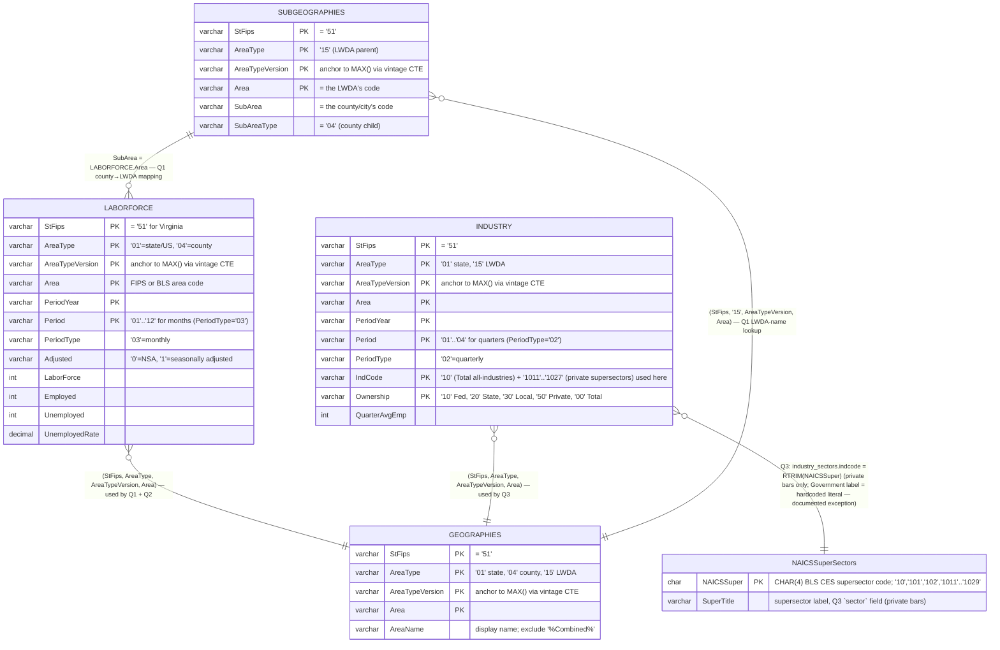
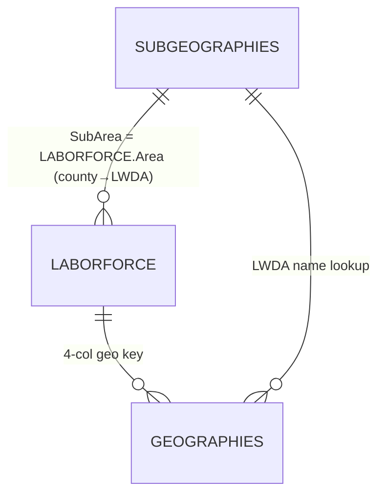
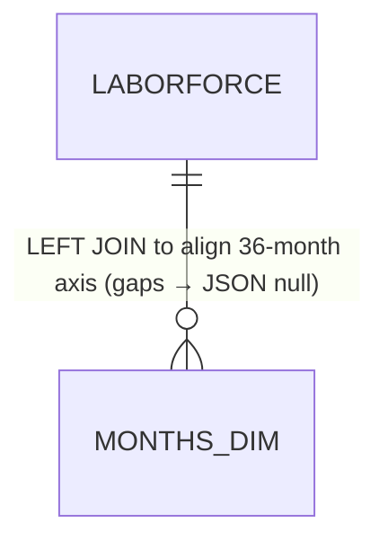
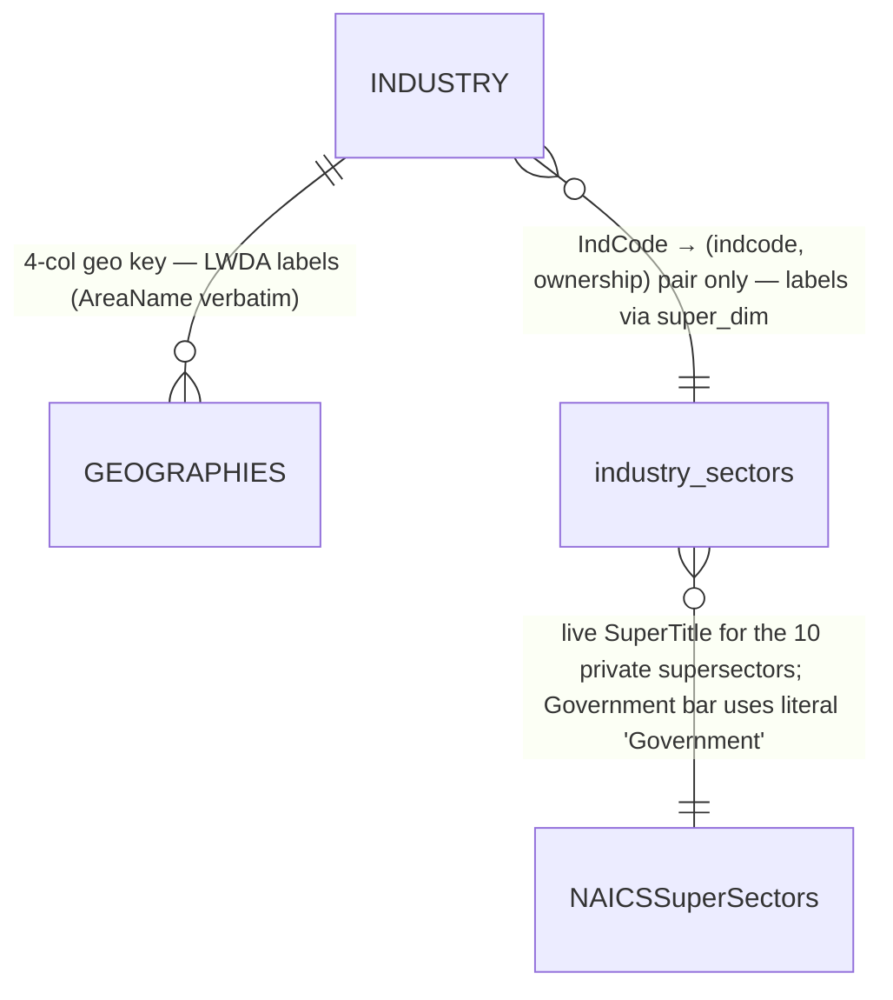

# Labor Market Snapshot Dashboard (Front Page)

> **Living document.** Any change to the SQL in `queries/labor_market_dashboard_mssql_RUN_v8.sql` must be reflected here — especially the ERD join keys, the Validation Status table, and the unit-test SELECTs. Treat the Validation Status table as the source of truth for what has been verified against the live WID server.

---

## Part 1 — Overview

### What this dashboard shows

The **Labor Market Snapshot** is the public-facing front page for Virginia Works. It presents a single-page view of Virginia's current labor market across three coordinated visualizations and a KPI row:

| Card | Visualization | What it answers |
|---|---|---|
| Left | **Choropleth map** of all 133 Virginia counties + independent cities | "How does my locality's unemployment compare to its neighbors?" |
| Center | **36-month line chart** of unemployment rate | "Is unemployment trending up or down across the state — and how does my county compare to Virginia overall?" |
| Right | **Top-5 industry bar chart** | "Which sectors added the most jobs last quarter — statewide, or in my LWDA?" |
| Header KPIs | Virginia rate, U.S. average rate (with month-over-month delta) | Headline numbers a journalist or policymaker can quote. |

When a county is selected (by clicking the map or using the dropdown), a fourth KPI tile appears and the line + bar charts re-render to that county / its LWDA. See [Cross-filter behavior](#cross-filter-behavior) below.

### Where the data comes from

All data flows out of the **WID 3.0 SQL Server** (Workforce Information Database, read-only Azure SQL Server instance hosted by VEC). The dashboard does **not** call the database at page load. Instead, a scheduled job runs the three SQL queries in `queries/labor_market_dashboard_mssql_RUN_v8.sql`, captures each `FOR JSON PATH` result as a static `.json` file, and deploys those JSON files alongside the HTML/JS bundle.

```
WID 3.0 SQL Server   ──►  RUN_v8.sql (3 queries)  ──►  3 JSON files  ──►  ECharts (browser)
(authoritative          (scheduled refresh)          (deployed             (renders charts)
 BLS source data)                                     statically)
```

This is a deliberate architecture choice:
- The dashboard is **fast** (no DB round-trip on page load) and **resilient** (the WID server going down does not break the public site).
- Refresh cadence is **decoupled** from page traffic — currently monthly, aligned to the BLS LAUS release schedule.

### Refresh cadence

| Source | Update frequency | Driving release |
|---|---|---|
| LABORFORCE (Q1 + Q2) | Monthly | BLS LAUS release (~3 weeks after month-end) |
| INDUSTRY (Q3) | Quarterly | BLS QCEW release (~5 months after quarter-end) |

The same scheduled job emits all three JSON files together. The dashboard's "Updated" pill reads the top-level `as_of` field from `employment_by_locality.json` (Q1's `FOR JSON PATH` projection emits `as_of` as a sibling of `kpi` and `counties`, not nested inside a `meta` envelope — the front page dashboard's JSON has no `meta` wrapper, unlike the Employer Wage Tool's `wages.json` / `industries.json`).

> **Maintenance note — page subtitle names its source programs.** The header subtitle in `index.html` reads *"Employment indicators for Virginia's workforce regions, drawn from BLS **LAUS** and **QCEW** data."* Those two program names are hardcoded copy, not derived from the artifacts. They match today's sources: Q1/Q2 are LAUS (`LABORFORCE`), Q3 is QCEW (`INDUSTRY`). **If the underlying `RUN_v8.sql` queries are ever repointed to different BLS source programs (e.g. CES/JOLTS for the jobs series, or a different labor-force source), update this subtitle to match.** This line previously read "Real-time … BLS LAUS and JOLTS feeds," which was wrong on both counts — the cadence is monthly/quarterly with a lag (not real-time), and JOLTS is not used anywhere in this app. Keep it accurate on cadence and source names.

### Cross-filter behavior

**Important: there is no region parameter on the SQL.** The SQL emits the full dataset — every county, every LWDA — and the browser does the slicing. This is how:

```
                        ┌─── employment_by_locality.json ── (133 counties pre-loaded)
ECharts boot ──fetch──┼─── unemployment_trend.json     ── (statewide series + 133 per-county arrays)
                        └─── jobs_by_industry.json       ── (statewide top-5 + 14 per-LWDA top-5s)

User clicks Fairfax County on map
         │
         ▼
ECharts 'selectchanged' fires with dataIndex of the clicked county
         │
         ▼
Handler reads attached metadata from the county's data row:
    STATE.selectedFips   = "51059"         ← Fairfax FIPS
    STATE.selectedRegion = "000451"        ← Fairfax's LWDA code (Northern)
         │
         ▼
applyFilter() re-renders:
    - KPI row     → adds a "Fairfax County" tile
    - Line chart  → looks up STATE.trendCountyMap["51059"] and adds a new series
    - Bar chart   → swaps statewide top-5 for STATE.industryRegionMap["000451"] (Northern LWDA's top-5)

User picks a county from the dropdown instead
         │
         ▼
selectByFips(fips) → dispatchAction({type:'select', dataIndex})
         │
         ▼
ECharts fires the SAME 'selectchanged' event — single code path, single source of truth
```

The **region** that drives the bar chart is **derived from the selected county**, not selected directly. Each county row in `employment_by_locality.json` carries its `region` (= `lwda_code`) and `lwda_short_name`. When the user picks a county, the dashboard auto-routes to that county's LWDA's top-5 industry view. There is no separate region selector.

**Why this matters for refresh:** if you change the SQL to add a column, add a new LWDA, or change the join semantics, the change must be reflected in **all three JSON payloads at once**, because the front-end joins them in memory by `fips` (county) and `region` / `lwda_code` (LWDA).

---

## Part 2 — Visualizations

Each visualization is backed by exactly one SQL query, which emits exactly one JSON file. The mapping:

| # | SQL CTE block in RUN_v8.sql | JSON output | Visualization |
|---|---|---|---|
| Q1 | Lines 40–200 (`employment_by_locality`) | `data/employment_by_locality.json` | Choropleth map + KPI tiles |
| Q2 | Lines 203–313 (`unemployment_trend`) | `data/unemployment_trend.json` | Line chart (statewide + per-county) |
| Q3 | Lines 316–519 (`jobs_by_industry`) | `data/jobs_by_industry.json` | Top-5 industry bar chart |

### Q1 — Choropleth + KPI tiles

**SQL output shape:**
```json
{
  "as_of": "2026-03",
  "kpi": {
    "virginia":   { "value": 3.8, "delta_pts": 0.0 },
    "us_average": { "value": 4.4, "delta_pts": 0.0 }
  },
  "counties": [
    {
      "fips": "51001",                // join key for the map (5-digit FIPS GEOID)
      "areaname": "Accomack County",
      "region": "000456",              // LWDA code (drives bar chart on click)
      "lwda_short_name": "Hampton Roads (LWDA XIV)",   // verbose AreaName verbatim, see note below
      "employment_rate": 95.1,
      "unemployed_rate": 4.9,
      "labor_force": 14578,
      "employed": 13862
    },
    ...
  ]
}
```

> **`lwda_short_name` value note (was changed).** The JSON field name is preserved for front-end compatibility, but the **value** is now `GEOGRAPHIES.AreaName` verbatim — `"Hampton Roads (LWDA XIV)"`, `"Greater Roanoke Region (LWDA III)"`, etc. — including the `(LWDA …)` suffix. Prior versions substring-parsed the AreaName to derive a short label (e.g. `"Hampton Roads"`), which violated the project [dimension-derived-labels standard](#) — no substring-parsing of dim fields. The verbose emission is the standard-compliant interim until WID adds a short-name column. Front-end UI may abbreviate at render time; the SQL never substring-parses.

**Semantics:**
- `kpi.virginia.value` is the **unemployment rate** (seasonally adjusted, `AreaType='01'`, `Adjusted='1'`).
- `kpi.virginia.delta_pts` is the **change in unemployment rate** vs. the prior month. Positive delta = unemployment went **up** = colored as "down" / coral in the UI.
- `kpi.us_average` is computed by summing `Unemployed` and `LaborForce` across all 50 states (any `StFips`, `AreaType='01'`, `Adjusted='1'`), with `HAVING COUNT(*) >= 50` as a guard against partial loads.
- `counties[].unemployed_rate` is **not** seasonally adjusted (county-level NSA is the only series BLS publishes at this geography).
- `fips` is constructed as `'51' + RIGHT(Area, 3)` — the 5-digit GEOID. The map registers VA-county GeoJSON keyed by that same FIPS (`feature.properties.name = String(f.id)`), so the data joins directly with no browser-side conversion. (Formerly emitted as the Highcharts key `'us-va-' + RIGHT(Area,3)` and unwound in JS via a `hcKeyToFips()` helper; both removed. See `docs/highcharts-legacy-audit.md`.)

### Q2 — Line chart (unemployment trend)

**SQL output shape:**
```json
{
  "months": ["2023-04", "2023-05", ..., "2026-03"],   // 36 entries, fixed window
  "series": {
    "virginia":    [3.1, 3.0, null, 3.2, ...],         // SA, statewide
    "us_national": [3.8, 3.8, 3.7, ...]                // SA, U.S.
  },
  "counties": [
    {
      "fips": "51001",
      "data": [4.6, 4.7, null, 5.1, ...]               // NSA, county-level
    },
    ...
  ]
}
```

**Semantics:**
- The window is **36 months ending at the latest LABORFORCE month** (driven by `latest` CTE, lines 214–223).
- `months` is the master x-axis. Source gaps (e.g. an Oct 2025 hole in the data) become JSON `null` at the correct index via `LEFT JOIN months_dim`; the front-end uses `connectNulls: false` so gaps render as line breaks, not interpolated values.
- `series.virginia` and `series.us_national` are always shown. The per-county line is only added when a county is selected — looked up by `fips` in `STATE.trendCountyMap`.
- `series.virginia` is **seasonally adjusted** (matches the headline KPI); `counties[].data` is **NSA** (only series available at county granularity).

### Q3 — Top-5 industry bar chart

**SQL output shape:**
```json
{
  "as_of_quarter": "2025-Q4",
  "statewide": [
    { "sector": "Professional & Business", "jobs_added": 12400 },
    { "sector": "Education & Health",      "jobs_added": 8200 },
    ...
  ],
  "regions": [
    {
      "key": "000451",                                    // LWDA code, joined to county.region in Q1
      "label": "Northern Region (LWDA XI)",                // verbose AreaName verbatim (was "Northern")
      "sectors": [
        { "sector": "Professional and Business Services", "jobs_added": 4100 },  // from NAICSSuperSectors.SuperTitle
        ...
      ]
    },
    ...
  ]
}
```

> **`regions[].label` and `sectors[].sector` value notes (were changed).** Both fields are now sourced live from WID dimension tables:
> - `regions[].label` = `GEOGRAPHIES.AreaName` verbatim (was a substring-parsed short label like `"Northern"`). Same change as Q1's `lwda_short_name` field — see the Q1 note above. Front-end abbreviates if needed.
> - `sectors[].sector` = `NAICSSuperSectors.SuperTitle` verbatim (was a hardcoded literal like `"Professional & Business"`). The dim's strings are the BLS-published canonical forms — `"Trade, Transportation and Utilities"`, `"Education and Health Services"`, `"Professional and Business Services"`. The Government bar's label is the one exception — see [Q3 Semantics](#q3--top-5-industry-bar-chart) below.

**Semantics:**
- "Jobs added" = `QuarterAvgEmp` in the latest quarter minus `QuarterAvgEmp` in the prior quarter. **Not** year-over-year. The `LAG(...) OVER (PARTITION BY ...)` window in `state_change` / `region_change` CTEs computes this.
- The 10 BLS CES supersector codes (`'1011'..'1027'`) are private-sector aggregates — each is filtered to `Ownership='50'` (Private) via the `industry_sectors` lookup CTE. The CTE is now an `(indcode, ownership)` pair only; the **labels** come live from `WID.dbo.NAICSSuperSectors.SuperTitle` via the `super_dim` CTE (per the project dimension-derived-labels standard — the hardcoded `sector_name` column on the VALUES is retired). **Load-bearing safeguard:** the `private_change_state` / `private_change_region` LEFT JOINs match on **both** `indcode` AND `Ownership` (against `industry_sectors`, which has no row for `'10'`). This is what prevents the `IndCode='10' Ownership='50'` "Total private" row — which now flows through `state_both_qtrs` upstream — from leaking into the top-5 private ranking and dominating it. If a future change ever simplifies that LEFT JOIN to match on `indcode` alone, the chart will silently start showing a giant "Total private" bar instead of the supersector breakdown. Do not simplify.
- **The Government row** is rolled up from the BLS pre-summed **Total-all-industries** supersector — `IndCode='10'`, with `Ownership IN ('10','20','30')` to restrict to Federal + State + Local employment across **every** industry (schools, hospitals, transit, etc.). This is the BLS-published canonical government total (~749k VA employees as of the 2025-Q4 extract). Prior versions of this query summed `IndCode='1028'` (NAICS-92 Public Administration) instead, which only captured ~265k workers — about a third of actual government employment. The fix was committed 2026-06-10 after the A vs. C audit (see below).
- The Government row's label is the hardcoded literal **'Government'** — the one documented dim-label exception in this query. The bar is a rollup over an ownership filter against a supersector total, not a 1:1 dimension row, so there's no clean `NAICSSuperSectors` title to source. (The dim's title for IndCode='10' is 'Total, all industries', which isn't what the bar represents.)
- Top 5 per scope (statewide and each LWDA) via `ROW_NUMBER() OVER (PARTITION BY scope ORDER BY jobs_added DESC)`. If a sector lost jobs (negative `jobs_added`) but still ranks in the top 5, it appears in the output (the front-end colors negative bars differently).
- **Audit reference (2026-06-10):** the rollup change above was driven by these three statewide totals at the latest quarter:
  - **A** = 264,752 — `IndCode='1028'` AND `Ownership IN ('10','20','30')` (what the query did before)
  - **B** = 748,815 — `IndCode IN ('1011'..'1028')` AND `Ownership IN ('10','20','30')` (supersector partition check)
  - **C** = 748,907 — `IndCode='10'` AND `Ownership IN ('10','20','30')` (BLS canonical, what the query does now)
  
  A << C (35% of C) — rollup bug. B ≈ C (99.99% of C) — the supersector partition tiles total nonfarm cleanly; the private-sector bars were never affected.

#### `Ownership='80'` isolation from the Government rollup

**What `'80'` is.** `Ownership='80'` carries ~343k VA rows of **government employment classified by industry of function** rather than employer ownership. A public school teacher's employer is State or Local government (`'20'`/`'30'`) AND their *industry of function* is Educational Services (NAICS 61) — so the same person also appears under `'80'` + IndCode 61. Same for public-hospital nurses (Health Care 62) and Public Administration workers (NAICS 92). These rows concentrate in NAICS `'92'`/`'61'`/`'62'`. **`'80'` sits OUTSIDE `'00'` Total Covered** — supplemental, not a constituent (P3 reconciliation confirmed `Ownership IN ('10','20','30','50')` sums to `'00'` at ratio `1.0000` across every supersector). This is a documented BLS QCEW construct, not dirty data; resolved by the 2026-06-10 audit. Full background in `docs/client-tickets/wid-data-quality-punchlist.md` Note B.

**Why this matters for Q3.** Including `'80'` in the Government rollup would double-count government workers already counted under `'10'`/`'20'`/`'30'` — the same teacher counted once as a State employee AND once as "works in Education." The rollup is structurally protected against this at two independent levels:

| Gate | CTE | Filter | Effect |
|---|---|---|---|
| Upstream | `state_both_qtrs` (line **432**) | `WHERE i.Ownership IN ('10','20','30','50')` | `'80'` rows never enter the fact-pool; downstream CTEs (`state_change`, `state_current_only`) can't see them. |
| Upstream | `region_both_qtrs` (line **500**) | `WHERE i.Ownership IN ('10','20','30','50')` | Same effect on the regional side. |
| Downstream | `gov_change_state` (line **481**) | `WHERE indcode = '10' AND Ownership IN ('10','20','30')` | `'80'` explicitly absent from the Government-rollup IN-list. |
| Downstream | `gov_change_region` (line **546**) | `... AND rc.Ownership IN ('10','20','30')` | Same on the regional side. |

Either layer alone would block `'80'`. Together they're belt-and-suspenders.

> **Load-bearing rule — DO NOT widen the gov filter.** The downstream `gov_change_state.Ownership IN ('10','20','30')` and `gov_change_region.Ownership IN ('10','20','30')` IN-lists are the integrity guarantee for the Government bar's number. **Never add `'80'` to either IN-list.** Doing so adds ~343k spurious workers (the size of the industry-of-function population) to the Government rollup, double-counting them — they're already in there once via their `'10'`/`'20'`/`'30'` ownership rows. A future contributor who sees `'80'` in the data and thinks "looks like another government code" would land here; this paragraph is your warning sign. Smoke Test 9 below test-enforces this rule.

**Empirical cross-check.** The audit measured the Government rollup at **748,907 VA**, which matches the BLS-published Fed+State+Local total. If `'80'` were leaking in (~343k rows), the audit would have measured ~1,091,907 — about a 46% over-count. The clean 748,907 confirms the exclusion works in production.

---

## Part 3 — Data model (ERDs)

All three queries read from **WID.dbo.\*** tables in the production WID 3.0 SQL Server. There are no local seed tables for the front page dashboard. All filtering and aggregation happen in T-SQL CTEs.

### Combined ERD — all tables and join keys

> **The 4-column geography join key** (StFips + AreaType + AreaTypeVersion + Area) is the canonical identity for any geographic row in WID. The `AreaTypeVersion` column is what makes joins safe across BLS vintage rollovers — without it, LWDA III's rename from "Western Virginia" (vintage 0000) to "Greater Roanoke Region" (vintage 0002) would silently corrupt joins. **Every fact table CTE pins to its own `MAX(AreaTypeVersion)` via a vintage anchor CTE.** Fact and dimension vintages are pinned independently and may legitimately differ — do not force them equal in joins.



**Join-key cheat sheet** (this is the most error-prone part of the codebase):

| Join | Composite key | Notes |
|---|---|---|
| `LABORFORCE` ↔ `GEOGRAPHIES` | `(StFips, AreaType, AreaTypeVersion, Area)` | All 4 columns required. AreaTypeVersion comes from a vintage anchor CTE per table. |
| `LABORFORCE` ↔ `lf_vintage` (anchor) | `(StFips, AreaType, AreaTypeVersion)` | Pins the fact table to its own MAX(AreaTypeVersion) per (StFips, AreaType) pair. |
| `GEOGRAPHIES` ↔ `g_vintage` (anchor) | `(StFips, AreaType, AreaTypeVersion)` | Pins the dim table independently. May differ from `lf_vintage`. |
| `SUBGEOGRAPHIES` ↔ `GEOGRAPHIES` (Q1 LWDA name) | `(StFips, AreaType, Area)` where SUBGEOGRAPHIES.Area = GEOGRAPHIES.Area (the LWDA's code) | Used to get the LWDA's `AreaName` for `lwda_short_name`. |
| `SUBGEOGRAPHIES` ↔ `LABORFORCE` (Q1 county→LWDA mapping) | `SUBGEOGRAPHIES.SubArea = LABORFORCE.Area` AND `SUBGEOGRAPHIES.SubAreaType = LABORFORCE.AreaType (='04')` | This is what assigns each county to its LWDA. |
| `INDUSTRY` ↔ `GEOGRAPHIES` (Q3) | `(StFips, AreaType, AreaTypeVersion, Area)` | Same 4-column pattern. AreaType pinned to `'15'` for LWDAs. |
| `industry_sectors` ↔ `super_dim` (Q3 private sector labels) | `industry_sectors.indcode = RTRIM(NAICSSuperSectors.NAICSSuper)` | Live label source for the 10 private CES supersectors via `super_dim` CTE. No vintage column. `industry_sectors` VALUES CTE no longer carries a hardcoded `sector_name` column. The Government bar is a rollup (`IndCode='10' + Ownership IN ('10','20','30')`) — its `'Government'` label is the **one documented dim-label exception** in this query. |

### Q1 call-out — `employment_by_locality.json`



Filters applied:
- `StFips = '51'` (Virginia)
- County rows: `AreaType = '04'`, `Adjusted = '0'`, `PeriodType = '03'`, `(PeriodYear, Period) = current_month`
- Statewide KPI rows: `AreaType = '01'`, `Adjusted = '1'` (seasonally adjusted)
- U.S. KPI rows: any `StFips`, `AreaType = '01'`, `Adjusted = '1'`, with `HAVING COUNT(*) >= 50` to guard against partial loads
- LWDA mapping: `SUBGEOGRAPHIES.AreaType = '15'` AND `GEOGRAPHIES.AreaName NOT LIKE '%Combined%'`

### Q2 call-out — `unemployment_trend.json`



Filters applied:
- VA statewide series: `StFips='51'`, `AreaType='01'`, `Adjusted='1'` (seasonally adjusted)
- U.S. statewide series: any `StFips`, `AreaType='01'`, `Adjusted='1'`, aggregated by `(PeriodYear, Period)` with `HAVING COUNT(*) >= 50`
- County series: `StFips='51'`, `AreaType='04'`, `Adjusted='0'` (NSA — only series published at county granularity)
- All series: `PeriodType='03'` (monthly)
- `months_dim` is a 36-row recursive CTE rooted at the latest period. `LEFT JOIN` semantics produce JSON `null` at the correct index when a source row is missing.

### Q3 call-out — `jobs_by_industry.json`



Filters applied:
- Statewide: `StFips='51'`, `AreaType='01'`, `PeriodType='02'`, `IndCode IN ('10','1011','1012','1013','1021','1022','1023','1024','1025','1026','1027')` — the 10 private supersectors plus the BLS Total-all-industries row `'10'` that drives the Government rollup.
- Per-LWDA: same IN-list but `AreaType='15'` and joined to `lwda_dim` (built from GEOGRAPHIES with `AreaName NOT LIKE '%Combined%'`).
- Both: `Ownership = '50'` (Private) for the 10 private supersectors `1011`–`1027`, selected via the `industry_sectors` lookup CTE which hardcodes `ownership = '50'` for each private code. The Government row is a separate `SUM` over `Ownership IN ('10','20','30')` (Federal + State + Local) inside `gov_change_state` / `gov_change_region`, restricted to `IndCode = '10'` (BLS Total-all-industries). The two scopes are disjoint by `(IndCode, Ownership)` pair, so no double-count.
- **Note (was changed 2026-06-10):** `'1028'` is no longer in the IN-list and the Government rollup no longer filters to it. See the Semantics section's audit (A/B/C numbers) for the rationale.
- Top 5 selection: `ROW_NUMBER() OVER (PARTITION BY scope ORDER BY jobs_added DESC) <= 5`

---

## Part 4 — Technical reference

### WID 3.0 conventions

| Convention | Detail |
|---|---|
| Schema | `WID.dbo.*` — single schema, all production tables |
| State filter | `StFips = '51'` for Virginia, always-quoted string |
| AreaType codes | `'01'` state/national, `'04'` county/independent city, `'15'` LWDA |
| AreaTypeVersion | Each table's vintage is independent; anchor via `MAX(AreaTypeVersion) GROUP BY (StFips, AreaType)` in a CTE |
| Adjusted | `'0'` = NSA, `'1'` = seasonally adjusted (LABORFORCE only) |
| PeriodType | `'02'` = quarterly (INDUSTRY), `'03'` = monthly (LABORFORCE) |
| Read-only | The scheduled job account has only `SELECT` rights. No temp tables, no DDL. |
| Min version | SQL Server 2017+ for `STRING_AGG`; 2016+ for `FOR JSON PATH`. Azure SQL (the prod host) satisfies both. |

### High-variance columns

Renaming any of these in SQL = silent wrong numbers (no error). Confirm via `_validate.sql` Probe 1.

- `LABORFORCE.UnemployedRate` — already a percentage (e.g. `4.9`, not `0.049`). Do not divide by 100.
- `LABORFORCE.LaborForce`, `LABORFORCE.Employed`, `LABORFORCE.Unemployed` — raw counts. `Employed + Unemployed = LaborForce`.
- `INDUSTRY.QuarterAvgEmp` — already an average across the 3 months of the quarter. Do not re-average.
- `INDUSTRY.IndCode` for BLS supersectors — note that **Manufacturing**, **Retail Trade**, and **Transportation & Warehousing** are stored as **range strings** (`'31-33'`, `'44-45'`, `'48-49'`) in some WID tables. The Q3 query uses the CES supersector codes `'10'` + `'1011'..'1027'` (4-digit) which do not have this problem, but watch for it if you extend to NAICS-2 level breakdowns.

### Why JSON-on-disk instead of live SQL

- Dashboard is public — load time is the user-experience constraint.
- WID server is internal and not built for public traffic patterns.
- A failed refresh produces stale-but-correct data (visible in the "Updated <month>" pill), not an outage.

### Validation Status

Each row marks whether an assumption has been **Confirmed** against the live WID server or is **Assumed (pending validation)** — i.e. derived from the WID 3.0 spec / earlier dashboards but not yet re-verified for the front-page queries specifically. Update this table whenever you re-run `_validate.sql` or spot-check the production output.

| # | Assumption | Status | Source of confirmation |
|---|---|---|---|
| 1 | `LABORFORCE` exposes `StFips, AreaType, AreaTypeVersion, Area, PeriodYear, Period, PeriodType, Adjusted, LaborForce, Employed, Unemployed, UnemployedRate` | **Assumed — pending validation** | Mirrors columns used in the predecessor Highcharts dashboard; not separately probed for v8. Run [Smoke Test 1](#smoke-test-1-column-inventory) to confirm. |
| 2 | `LABORFORCE.AreaType = '04'` for VA counties | **Confirmed** | Used by the predecessor labor market dashboard for ≥1 year without correction. |
| 3 | `LABORFORCE.AreaType = '01'` for the state and national totals | **Confirmed** | Same as #2. |
| 4 | `LABORFORCE.Adjusted = '1'` = seasonally adjusted | **Confirmed** | Validated in the Employer Wage Tool `_validate.sql` Probe 4 (parallel WID convention). |
| 5 | `LABORFORCE.PeriodType = '03'` for monthly | **Confirmed** | Same as #4. |
| 6 | `fips = '51' + RIGHT(LABORFORCE.Area, 3)` produces the 5-digit GeoJSON join key | **Confirmed by construction-parity + geometry join — not yet run against the client's SQL Server** | The `fips = '51'+RIGHT(Area,3)` construction is identical to `community_profiles_mssql_RUN.sql:134`, which **is** validated on prod (validate P3c → Alexandria `51510`); a prior extract confirmed `RIGHT(Area,3)` = 510/059/710; and the deployed artifact joins **133/133** against live us-atlas geometry with 0 unmatched in either direction. It has **not** been run against the client's SQL Server for the v8 Q1/Q2 queries specifically — re-confirm via [Smoke Test 4](#smoke-test-4-fips-construction). Formerly the Highcharts `us-va-NNN` key, removed 2026-07-29 (`docs/highcharts-legacy-audit.md`). |
| 7 | `SUBGEOGRAPHIES.SubArea = LABORFORCE.Area` for county→LWDA mapping (with `SubAreaType = '04'`) | **Assumed — pending validation** | The Q1 region_mapping CTE depends on this shape. Run [Smoke Test 3](#smoke-test-3-lwda-county-mapping-completeness). |
| 8 | 14 LWDAs return after the `AreaName NOT LIKE '%Combined%'` filter | **Confirmed** | Verified for the Employer Wage Tool on 2026-06-05 (`_setup.sql` seed). |
| 9 | `lwda_short_name` field is now `GEOGRAPHIES.AreaName` verbatim — substring-parser RETIRED per the project dimension-derived-labels standard. Was previously: "AreaName always starts with the LWDA short name followed by ` (LWDA …)` or ` Region`" — an assumption that's no longer load-bearing. | **Confirmed (architectural decision, 2026-06-10)** | `region_mapping` (Q1) and `lwda_dim` (Q3) CTEs both emit `g.AreaName` verbatim into `lwda_short_name` and (in Q3) `regions[].label`. The JSON field names are preserved for front-end compatibility; values are verbose ("Hampton Roads (LWDA XIV)" etc.). Load gap: `GEOGRAPHIES.ShortName` not present on this install (probe RESULTS LOG P6). |
| 10 | `INDUSTRY` exposes `QuarterAvgEmp, IndCode, Ownership, PeriodType, Period` | **Confirmed** | Verified for the Employer Wage Tool `_validate.sql` Probe 1 (2026-06-05). |
| 11 | BLS CES supersector codes `'10'` (Total all-industries) + `'1011'..'1027'` (private supersectors) exist in `INDUSTRY.IndCode` at AreaType `'01'`. The `'10'` row drives the corrected Government rollup. | **Confirmed at AreaType='01'** (2026-06-10 audit returned 748,907 for `IndCode='10' AND Ownership IN ('10','20','30')`). **Assumed at AreaType='15'** — verify via [Smoke Test 5](#smoke-test-5-supersector-coverage) on next refresh; if `'10'` rows aren't loaded at the LWDA level, per-LWDA Government bars will render NULL. |
| 12 | `IndCode='10' AND Ownership IN ('10','20','30')` summed across the BLS Total-all-industries supersector = total Fed+State+Local government employment | **Confirmed (2026-06-10 audit)** | Statewide: 748,907 employees. Replaced the prior assumption that `IndCode='1028' AND Ownership IN ('10','20','30')` was the right rollup — that filter returned only 264,752 (NAICS-92 Public Administration only). See Q3 Semantics A/B/C audit. |
| 13 | Fact tables (LABORFORCE / INDUSTRY) and the GEOGRAPHIES dimension may carry **different** `AreaTypeVersion` values. The two vintages should be pinned independently and joined on `(StFips, AreaType, Area)` only — not on `AreaTypeVersion`. | **Confirmed (architectural decision)** | This is the established pattern in `queries/employer_wage_tool_mssql_RUN.sql` (lines 222–227) and applies here as well. |
| 14 | `WID.dbo.NAICSSuperSectors` is LOADED. 15 rows, including the 10 private CES supersectors `'1011'..'1027'` with SuperTitle labels. Q3 `regions[].sectors[].sector` (and the statewide bars) come live from this dim via `super_dim`. No vintage column — flat reference dim. | **Confirmed** | `queries/dimension_resolution_probe.sql` P5 RESULTS LOG (2026-06-10). The hardcoded `sector_name` column on the Q3 `industry_sectors` VALUES CTE is retired. Notable label deltas vs prior hardcoded values: `'1021'` = "Trade, Transportation and Utilities" (was "Trade & Transportation"); `'1024'` = "Professional and Business Services" (was "Professional & Business"); `'1025'` = "Education and Health Services" (was "Education & Health"); `'1026'` = "Leisure and Hospitality" (was "Leisure & Hospitality"). |
| 15 | The Government bar's label is the **literal `'Government'`** — the one documented dim-label exception in this query. The bar is rollup-derived (`IndCode='10' + Ownership IN ('10','20','30')`), not a 1:1 supersector row. The dim's `'1028'` SuperTitle is "Public Administration" (NAICS-92 only, not what the bar represents); the dim's `'10'` SuperTitle is "Total, all industries" (also not what the bar represents). | **Confirmed (architectural decision)** | `gov_change_state` and `gov_change_region` CTEs in `_RUN_v8.sql`. Aligned with the [feedback-dimension-derived-labels](#) standard's exception clause for rollup-derived series. |
| 16 | `WID.dbo.GEOGRAPHIES` has no ShortName / Alias / DisplayName / Abbreviation column on this install. `lwda_short_name` / `regions[].label` carry the verbose AreaName instead. | **Confirmed (load gap)** | `queries/dimension_resolution_probe.sql` P6 RESULTS LOG (2026-06-10). Load gap against the WID owner: "GEOGRAPHIES has no LWDA short-name column." Verbose emission is the standard-compliant interim. |
| 17 | `INDUSTRY.Ownership='80'` is industry-of-function government employment (~343k VA rows; public teachers under NAICS 61, public-hospital nurses under NAICS 62, Public Administration under NAICS 92). It sits **OUTSIDE** `'00'` Total Covered (P3 reconciliation: `Ownership IN ('10','20','30','50')` sums to `'00'` at ratio `1.0000`). Q3 intentionally excludes `'80'` at two independent levels: upstream `state_both_qtrs:432` / `region_both_qtrs:500` filter `Ownership IN ('10','20','30','50')` AND downstream `gov_change_state:481` / `gov_change_region:546` filter `Ownership IN ('10','20','30')`. Including `'80'` would double-count government workers already counted under `'10'`/`'20'`/`'30'`. | **Confirmed (architectural decision, 2026-06-10 audit)** | Commit `5a7d8da`. Empirical cross-check: Government rollup measured at 748,907 VA — matches BLS Fed+State+Local. A leak would have produced ~1.09M (~46% over). Full reasoning in [`Ownership='80'` isolation from the Government rollup](#ownership80-isolation-from-the-government-rollup) under Q3 Semantics and `docs/client-tickets/wid-data-quality-punchlist.md` Note B. Test-enforced by [Smoke Test 9](#smoke-test-9-q3-government-bar-80-isolation-guard). |

---

## Part 5 — Unit-test validation SQL

Run these SELECT statements directly in SQL Server Management Studio (SSMS) or Azure Data Studio against the WID server. All queries are read-only.

> **Anchor your expectations.** All hard-coded expected values in this section are anchored to the **2026-06-05 WID extract** (current production JSON deploy). After any monthly refresh, expected values for `current_month` and `as_of_quarter` will advance. A "fail" is when the *shape* changes (column count, distinct LWDA count, etc.), not when the numbers move.

### Tier 1 — Sanity counts

#### Smoke Test 1: Column inventory
Confirms all expected columns exist on the 3 source tables. Resolves Validation Status row **#1**.

```sql
-- EXPECT: rows for every column listed in the ERD.
-- If any expected column is missing, the query in RUN_v8.sql will fail or
-- silently return wrong numbers (the worse case).
SELECT TABLE_NAME, COLUMN_NAME, DATA_TYPE, CHARACTER_MAXIMUM_LENGTH
FROM WID.INFORMATION_SCHEMA.COLUMNS
WHERE TABLE_NAME IN ('LABORFORCE','GEOGRAPHIES','SUBGEOGRAPHIES','INDUSTRY')
ORDER BY TABLE_NAME, ORDINAL_POSITION;
```

#### Smoke Test 2: Distinct LWDA + county counts
```sql
-- EXPECT (anchored to 2026-06-05 extract):
--   lwda_count    = 14
--   county_count  = 133
-- The dashboard JSON ships 133 counties + 14 LWDAs. Any other count means
-- a vintage rolled or the AreaName filter is mis-matching.
--
-- NOTE: Vintage is anchored PER AreaType (GROUP BY AreaType in geo_vintage),
-- mirroring the production pattern in RUN_v8.sql. A single scalar MAX over
-- both AreaTypes would filter both to the higher vintage and return 0 rows
-- for the lower-vintage AreaType — a false failure. County ('04') and LWDA
-- ('15') vintages roll independently.
WITH geo_vintage AS (
    SELECT AreaType, MAX(AreaTypeVersion) AS AreaTypeVersion
    FROM WID.dbo.GEOGRAPHIES
    WHERE StFips = '51' AND AreaType IN ('04','15')
    GROUP BY AreaType
)
SELECT
    COUNT(DISTINCT CASE WHEN g.AreaType = '15'
                        AND g.AreaName NOT LIKE '%Combined%' THEN g.Area END) AS lwda_count,
    COUNT(DISTINCT CASE WHEN g.AreaType = '04' THEN g.Area END)                AS county_count
FROM WID.dbo.GEOGRAPHIES g
JOIN geo_vintage gv
  ON g.AreaType = gv.AreaType AND g.AreaTypeVersion = gv.AreaTypeVersion
WHERE g.StFips = '51';
```

#### Smoke Test 3: LWDA-county mapping completeness
Resolves Validation Status row **#7**.
```sql
-- EXPECT (anchored to 2026-06-05 extract):
--   total_counties_mapped = 133  (one row per county)
--   lwda_count            = 14   (every county assigned to exactly one LWDA)
-- A county count below 133 means SUBGEOGRAPHIES is missing rows OR the
-- SubAreaType filter is wrong — the Q1 region_mapping CTE would emit NULL
-- region for those counties and the bar-chart cross-filter would silently
-- ignore them.
SELECT
    COUNT(DISTINCT sg.SubArea)              AS total_counties_mapped,
    COUNT(DISTINCT sg.Area)                 AS lwda_count
FROM WID.dbo.SUBGEOGRAPHIES sg
WHERE sg.StFips = '51' AND sg.AreaType = '15'
  AND sg.AreaTypeVersion = (
      SELECT MAX(AreaTypeVersion)
      FROM WID.dbo.SUBGEOGRAPHIES
      WHERE StFips = '51' AND AreaType = '15'
  );
```

#### Smoke Test 4: fips construction
Resolves Validation Status row **#6**. Spot-check that `'51' + RIGHT(Area, 3)` for Alexandria produces `'51510'`.
```sql
-- EXPECT (anchored to 2026-06-05 extract):
--   Alexandria city, fips = 51510
--   Fairfax County,  fips = 51059
--   Norfolk city,    fips = 51710
-- These three are the canonical join-key spot-checks. If any returns a
-- different fips, the `'51' + RIGHT(Area, 3)` assumption is wrong and the
-- choropleth will silently mis-color counties.
SELECT
    g.Area, g.AreaName,
    '51' + RIGHT(g.Area, 3) AS fips
FROM WID.dbo.GEOGRAPHIES g
WHERE g.StFips = '51' AND g.AreaType = '04'
  AND g.AreaTypeVersion = (
      SELECT MAX(AreaTypeVersion)
      FROM WID.dbo.GEOGRAPHIES
      WHERE StFips = '51' AND AreaType = '04'
  )
  AND g.AreaName IN ('Alexandria city', 'Fairfax County', 'Norfolk city')
ORDER BY g.AreaName;
```

#### Smoke Test 5: Supersector coverage
Resolves Validation Status row **#11**. Checks that all 11 IndCodes Q3 now uses (the BLS Total-all-industries row `'10'` + the 10 private supersectors `'1011'..'1027'`) are populated at both AreaType='01' (statewide) and AreaType='15' (LWDA).
```sql
-- EXPECT (anchored to 2026-06-05 extract, re-anchored for the IndCode='10'
-- row on 2026-06-10):
--   AreaType='01':  distinct_codes = 11,  coverage_pct = 100.0%
--   AreaType='15':  distinct_codes = 11,  coverage_pct = 100.0%
-- A drop to 10/11 (~90.9%) at AreaType='15' is the leading indicator that
-- IndCode='10' isn't loaded at the LWDA level — the per-LWDA Government
-- bars will then render NULL. Treat as a WID load gap; file a ticket.
WITH ind_vintage AS (
    SELECT AreaType, MAX(AreaTypeVersion) AS AreaTypeVersion
    FROM WID.dbo.INDUSTRY
    WHERE StFips = '51' AND AreaType IN ('01','15')
    GROUP BY AreaType
)
SELECT
    i.AreaType,
    COUNT(DISTINCT i.IndCode) AS distinct_codes,
    CAST(100.0 * COUNT(DISTINCT i.IndCode) / 11 AS DECIMAL(5,1)) AS coverage_pct
FROM WID.dbo.INDUSTRY i
JOIN ind_vintage iv
  ON i.AreaType = iv.AreaType AND i.AreaTypeVersion = iv.AreaTypeVersion
WHERE i.StFips = '51'
  AND i.PeriodType = '02'
  AND i.IndCode IN ('10','1011','1012','1013','1021','1022','1023','1024','1025','1026','1027')
GROUP BY i.AreaType
ORDER BY i.AreaType;
```

> Smoke Tests 6 and 7 are intentionally reserved (parallel slots to the Employer Wage Tool handover doc's tests 6 and 7, where they have specific meanings). Smoke Test 8 below is the first Tier-1 test added under the Government rollup correction.

#### Smoke Test 8: Q3 private-bar leak guard (IndCode='10' isolation)
**Asserts an architectural invariant**, not data freshness. Filed 2026-06-10 as a permanent Tier-1 check after the Government rollup correction added `IndCode='10'` to the upstream supersector IN-list. The `IndCode='10' Ownership='50'` row (= total private employment across all NAICS) now lives in `state_both_qtrs` / `region_both_qtrs`; the only thing keeping it out of the private supersector top-5 ranking is **one JOIN condition** in `private_change_state` / `private_change_region`:

```sql
LEFT JOIN state_current_only sc
  ON sc.indcode = s.indcode AND sc.Ownership = s.ownership   -- ← load-bearing
```

If a future maintainer simplifies that to `ON sc.indcode = s.indcode` (thinking the codes uniquely identify supersectors), `IndCode='10' Ownership='50'` immediately leaks in and dominates the top 5 bar chart with a "total private" bar. The leak is silent at run time, but produces an obviously-wrong public dashboard.

```sql
-- SMOKE TEST 8 — Q3 private bar safeguard
-- Reproduces the production private-JOIN structure (industry_sectors VALUES
-- CTE + LEFT JOIN matching on both indcode AND Ownership) and asserts that
-- no row containing IndCode='10' or Ownership <> '50' can reach the
-- private side.
--
-- EXPECT (anchored to refresh — assertion holds regardless of period):
--   * Exactly 10 rows, one per private supersector.
--   * Every row has verdict='ok'.
--   * Every matched_code is in ('1011'..'1027') and matched_own = '50'.
--   * leak_potential_employment is a single number on each row showing the
--     size of the IndCode='10' Ownership='50' fact-table row that WOULD
--     dominate the top 5 if the safeguard fails. Informational only.
--
-- Failure modes:
--   * verdict = '*** LEAK *** IndCode=10 reached private side'
--     → the private LEFT JOIN no longer matches on Ownership. Compare
--       RUN_v8.sql line ~410 (state) and ~473 (region); the `AND
--       sc.Ownership = s.ownership` clause must be present.
--   * verdict = '*** LEAK *** Ownership not 50'
--     → similar, but a non-private ownership leaked.
--   * verdict = '*** UNEXPECTED *** no private match'
--     → the live INDUSTRY table is missing one of the 10 private
--       supersector rows. Not a leak, but Q3 will show empty bars.
--       File against the WID load, not the SQL.
--
-- Note on scope: this test covers AreaType='01' (statewide). The
-- private_change_region join at AreaType='15' uses the same
-- industry_sectors lookup with the same JOIN clause — if statewide is
-- safe, regional is safe by the same mechanism.

WITH i_vintage AS (
    SELECT AreaType, MAX(AreaTypeVersion) AS AreaTypeVersion
    FROM WID.dbo.INDUSTRY WHERE StFips='51' AND AreaType='01' GROUP BY AreaType
),
latest_q AS (
    SELECT MAX(i.PeriodYear + '-' + i.Period) AS max_yq
    FROM WID.dbo.INDUSTRY i
    JOIN i_vintage iv ON i.AreaType=iv.AreaType AND i.AreaTypeVersion=iv.AreaTypeVersion
    WHERE i.StFips='51' AND i.AreaType='01' AND i.PeriodType='02' AND i.Period <> '00'
),
industry_sectors AS (
    SELECT * FROM (VALUES
        ('1011','50'),('1012','50'),('1013','50'),
        ('1021','50'),('1022','50'),('1023','50'),
        ('1024','50'),('1025','50'),('1026','50'),('1027','50')
    ) AS t(indcode, ownership)
),
-- Mirrors state_both_qtrs latest-quarter slice (the upstream pool that
-- contains the IndCode='10' Ownership='50' row the safeguard must filter).
fact_pool AS (
    SELECT LTRIM(RTRIM(i.IndCode)) AS indcode, i.Ownership,
           TRY_CAST(i.QuarterAvgEmp AS INT) AS emp
    FROM WID.dbo.INDUSTRY i
    JOIN i_vintage iv ON i.AreaType=iv.AreaType AND i.AreaTypeVersion=iv.AreaTypeVersion
    CROSS JOIN latest_q lq
    WHERE i.StFips='51' AND i.AreaType='01' AND i.PeriodType='02'
      AND (i.PeriodYear + '-' + i.Period) = lq.max_yq
      AND i.IndCode IN ('10','1011','1012','1013','1021','1022','1023','1024','1025','1026','1027')
      AND i.Ownership IN ('10','20','30','50')
),
leak_size AS (
    SELECT emp AS leak_potential_employment
    FROM fact_pool
    WHERE indcode='10' AND Ownership='50'
)
-- Strict (production) join: match on BOTH indcode AND Ownership
SELECT
    s.indcode    AS expected_code,
    s.ownership  AS expected_own,
    p.indcode    AS matched_code,
    p.Ownership  AS matched_own,
    p.emp        AS matched_emp,
    (SELECT leak_potential_employment FROM leak_size) AS leak_potential_employment,
    CASE
        WHEN p.indcode = '10'                       THEN '*** LEAK *** IndCode=10 reached private side'
        WHEN p.Ownership <> '50'
             AND p.Ownership IS NOT NULL            THEN '*** LEAK *** Ownership not 50'
        WHEN p.indcode IS NULL                      THEN '*** UNEXPECTED *** no private match for ' + s.indcode
        WHEN p.indcode <> s.indcode                 THEN '*** LEAK *** indcode mismatch'
        ELSE 'ok'
    END                                              AS verdict
FROM industry_sectors s
LEFT JOIN fact_pool p
  ON p.indcode = s.indcode AND p.Ownership = s.ownership   -- ← reproduces the load-bearing condition
ORDER BY s.indcode;
```

#### Smoke Test 9: Q3 Government bar `'80'` isolation guard (integration tier)

**This is an integration test, not a pure smoke test.** It execs the production Q3 Government-rollup CTE chain from `queries/labor_market_dashboard_mssql_RUN_v8.sql` lines ~411–481 verbatim against the live WID and asserts the resulting Government-bar employment value falls inside a band tuned to detect the `'80'` leak signature. Live-data dependency: `WID.dbo.INDUSTRY` at `AreaType='01'`. Place this test alongside the live-data spot-checks in your refresh runbook, not in the column-inventory tier.

The reason this test execs production SQL rather than recomputing a clean reference sum: a test that builds its own filter from scratch passes even when production widens its filter to include `'80'` — the test stops enforcing the rule it documents. By executing the production CTE chain verbatim, this test catches both BLS-side and SQL-side leaks, with one maintenance convention: **if you change the production CTEs, you MUST update this test's CTEs to match.** The two copies are deliberately coupled.

**What the leak signature looks like (the band is tuned around these numbers):**
- Clean rollup (`Ownership IN ('10','20','30')`): **~749k VA** (2026-06-10 audit: `748,907`)
- With `'80'` leaking in (`Ownership IN ('10','20','30','80')`): **~1.09M VA** (+343k)
- Gap: ~340k. Normal BLS year-over-year workforce drift is ~5-10% (~40-75k). The gap is ~4-8× the drift envelope, so a band-based verdict stays robust to legitimate workforce movement.

**Verdict logic:**

| `gov_bar_emp` range | Verdict | Meaning |
|---|---|---|
| `[600k, 950k)` | `'ok'` | Clean rollup, inside the BLS Fed+State+Local plausibility envelope. |
| `[950k, 1,000k)` | `'*** AMBIGUOUS *** investigate'` | Either real workforce growth OR a partial leak. Re-anchor against the BLS-published Fed+State+Local total for the current quarter before declaring pass/fail. |
| `≥ 1,000k` | `'*** LEAK ***'` | Matches the ~1.09M leak signature. Production Q3 has likely widened `Ownership IN` to include `'80'` (or some other Government-counting code). Check `_RUN_v8.sql` line ~481 (state) and ~546 (region); the IN-list must be exactly `('10','20','30')`. |
| `< 600k` | `'*** PLAUSIBILITY ***'` | Re-anchor — either BLS revision, vintage rollover, or a different kind of regression (missing data, broken upstream IN-list). |
| `NULL` | `'*** UNEXPECTED ***'` | No rollup row produced. Likely vintage anchor or BLS load gap. |

```sql
-- SMOKE TEST 9 — Q3 Government bar '80' isolation guard (integration)
-- LIVE-DATA DEPENDENCY: WID.dbo.INDUSTRY at AreaType='01'.
-- CTEs below are an EXACT COPY of queries/labor_market_dashboard_mssql_RUN_v8.sql
-- Q3 lines ~411–481 (state_both_qtrs + state_current_only + gov_change_state),
-- simplified to current-quarter only (no LAG/prior-quarter rows — the leak
-- signature is in the absolute rollup value, not the jobs_added delta).
--
-- *** LOAD-BEARING SYNC CONVENTION ***
-- If you change ANY of these in queries/labor_market_dashboard_mssql_RUN_v8.sql:
--   * state_both_qtrs filter (IndCode IN-list, Ownership IN-list, AreaType)
--   * gov_change_state filter (IndCode='10', Ownership IN-list)
-- you MUST mirror the change in this test's CTEs below, OR this test silently
-- drifts from production and stops enforcing the leak guard. The two copies
-- are intentionally coupled. There is no automation enforcing the sync —
-- maintainer discipline only.

WITH
i_vintage AS (
    SELECT AreaType, MAX(AreaTypeVersion) AS AreaTypeVersion
    FROM WID.dbo.INDUSTRY
    WHERE StFips = '51' AND AreaType = '01'
    GROUP BY AreaType
),
latest_quarter AS (
    SELECT MAX(CONCAT(i.PeriodYear, '-', i.Period)) AS max_yq
    FROM WID.dbo.INDUSTRY i
    JOIN i_vintage iv
      ON i.AreaType = iv.AreaType AND i.AreaTypeVersion = iv.AreaTypeVersion
    WHERE i.StFips = '51' AND i.AreaType = '01' AND i.PeriodType = '02'
      AND i.Period <> '00'
),
current_q AS (
    SELECT SUBSTRING(max_yq, 1, 4) AS yr, SUBSTRING(max_yq, 6, 2) AS qtr
    FROM latest_quarter
),
state_both_qtrs AS (
    -- COPY of RUN_v8.sql state_both_qtrs (current-quarter slice only).
    SELECT TRIM(i.IndCode) AS indcode, i.Ownership,
           TRY_CAST(i.QuarterAvgEmp AS BIGINT) AS current_emp
    FROM WID.dbo.INDUSTRY i
    JOIN i_vintage iv
      ON i.AreaType = iv.AreaType AND i.AreaTypeVersion = iv.AreaTypeVersion
    CROSS JOIN current_q cq
    WHERE i.StFips = '51' AND i.AreaType = '01' AND i.PeriodType = '02'
      AND i.IndCode IN ('10','1011','1012','1013','1021','1022','1023','1024','1025','1026','1027')
      AND i.Ownership IN ('10','20','30','50')                       -- ← LOAD-BEARING (sync with prod)
      AND i.PeriodYear = cq.yr AND i.Period = cq.qtr
),
gov_rollup AS (
    -- COPY of RUN_v8.sql gov_change_state filter (current-quarter SUM only).
    SELECT SUM(COALESCE(current_emp, 0)) AS gov_bar_emp
    FROM state_both_qtrs
    WHERE indcode = '10' AND Ownership IN ('10','20','30')           -- ← LOAD-BEARING (sync with prod)
),
-- Informational: surfaces the '80' fact-table population at IndCode='10' so
-- the operator can see what the leak would add if the IN-list were widened.
-- Not used in the verdict — the verdict is based on the production rollup
-- itself, which is what would actually drive the dashboard.
leak_context AS (
    SELECT SUM(TRY_CAST(i.QuarterAvgEmp AS BIGINT)) AS ind10_own80_emp
    FROM WID.dbo.INDUSTRY i
    JOIN i_vintage iv
      ON i.AreaType = iv.AreaType AND i.AreaTypeVersion = iv.AreaTypeVersion
    CROSS JOIN current_q cq
    WHERE i.StFips = '51' AND i.AreaType = '01' AND i.PeriodType = '02'
      AND i.IndCode = '10' AND i.Ownership = '80'
      AND i.PeriodYear = cq.yr AND i.Period = cq.qtr
)
SELECT
    gr.gov_bar_emp,
    lc.ind10_own80_emp                          AS leak_size_if_widened,
    gr.gov_bar_emp + ISNULL(lc.ind10_own80_emp, 0) AS leak_signature_total,
    CASE
        WHEN gr.gov_bar_emp IS NULL              THEN '*** UNEXPECTED *** no rollup row produced'
        WHEN gr.gov_bar_emp >= 1000000           THEN '*** LEAK *** rollup ≥ 1.0M matches the leak signature; check _RUN_v8.sql gov_change_state:481 and gov_change_region:546 — IN-list must be exactly (''10'',''20'',''30'')'
        WHEN gr.gov_bar_emp >= 950000            THEN '*** AMBIGUOUS *** rollup in [950k, 1M) — re-anchor against BLS Fed+State+Local published total for the current quarter before pass/fail'
        WHEN gr.gov_bar_emp < 600000             THEN '*** PLAUSIBILITY *** rollup < 600k — re-anchor; BLS revision, vintage rollover, or upstream regression'
        ELSE 'ok'
    END                                          AS verdict
FROM gov_rollup gr CROSS JOIN leak_context lc;
```

> **Scope note.** This test covers `AreaType='01'` (statewide). The `region_both_qtrs` upstream and `gov_change_region` downstream at `AreaType='15'` use the same IN-lists with the same mechanism — if statewide is safe, regional is safe by the same logic. The band `[600k, 950k]` for `'ok'` is anchored to the 2026-06-10 audit (`748,907`) plus a generous BLS year-over-year drift envelope (~5-10%); the `≥ 1,000k` LEAK threshold sits ~91k below the leak signature (`~1.09M`), leaving room for drift without false positives. Re-anchor against the BLS-published Fed+State+Local total — NOT against this test's own historical pass — if VA's workforce changes materially.

### Tier 2 — Spot-checks (anchored to 2026-06-05 extract)

#### Spot-check A — Fairfax County unemployment rate
```sql
-- EXPECT (anchored to the 2026-06-05 extract, period 2026-03):
--   Fairfax County, UnemployedRate = 3.6
-- If the rate is different but the latest period has rolled forward to
-- 2026-04 or later, that is an expected refresh (not a regression).
-- Update the expected value here when you next verify.
SELECT
    lf.PeriodYear, lf.Period, g.AreaName,
    lf.UnemployedRate,
    lf.LaborForce, lf.Employed
FROM WID.dbo.LABORFORCE lf
JOIN WID.dbo.GEOGRAPHIES g
  ON g.StFips = lf.StFips AND g.AreaType = lf.AreaType AND g.Area = lf.Area
WHERE lf.StFips = '51' AND lf.AreaType = '04'
  AND lf.Adjusted = '0' AND lf.PeriodType = '03'
  AND g.AreaName = 'Fairfax County'
  AND (lf.PeriodYear + '-' + lf.Period) = (
      SELECT MAX(PeriodYear + '-' + Period) FROM WID.dbo.LABORFORCE
      WHERE StFips = '51' AND AreaType = '04'
        AND Adjusted = '0' AND PeriodType = '03'
        AND UnemployedRate IS NOT NULL
  );
```

#### Spot-check B — Virginia statewide rate (matches the headline KPI)
```sql
-- EXPECT (anchored to the 2026-06-05 extract, period 2026-03):
--   UnemployedRate = 3.8  (matches kpi.virginia.value in employment_by_locality.json)
SELECT
    lf.PeriodYear, lf.Period, lf.UnemployedRate
FROM WID.dbo.LABORFORCE lf
WHERE lf.StFips = '51' AND lf.AreaType = '01'
  AND lf.Adjusted = '1' AND lf.PeriodType = '03'
  AND (lf.PeriodYear + '-' + lf.Period) = (
      SELECT MAX(PeriodYear + '-' + Period) FROM WID.dbo.LABORFORCE
      WHERE StFips = '51' AND AreaType = '01'
        AND Adjusted = '1' AND PeriodType = '03'
        AND UnemployedRate IS NOT NULL
  );
```

#### Spot-check C — Latest INDUSTRY quarter
```sql
-- EXPECT (anchored to the 2026-06-05 extract):
--   max_yq = '2025-04'  (Q4 2025 — matches as_of_quarter '2025-Q4' in jobs_by_industry.json)
SELECT MAX(PeriodYear + '-' + Period) AS max_yq
FROM WID.dbo.INDUSTRY
WHERE StFips = '51' AND AreaType = '01'
  AND PeriodType = '02' AND Period <> '00';
```

### Tier 3 — Reconciliation

> The reconciliation tier is the most important check after a refresh. It catches **AreaTypeVersion vintage double-counting**, which is the failure mode the per-table vintage anchor pattern guards against. If the vintage anchors are silently misaligned (e.g. two LABORFORCE vintages stacked), the sum across LWDAs will be ≈ 2× the statewide total — and the per-county rates will look right.

#### Recon 1 — LABORFORCE: sum of county labor force ≈ statewide labor force (NSA-to-NSA)
```sql
-- EXPECT (anchored to the 2026-06-05 extract, period 2026-03):
--   sum_county_lf  ≈ va_statewide_lf  (within ~0.5%)
--
-- LAUS county estimates are constructed to rake to the state NSA control
-- total (the BLS state-area unemployment estimate, non-seasonally adjusted).
-- This reconciliation MUST be NSA-to-NSA: both sides use Adjusted='0'.
-- Comparing county NSA to statewide SA (Adjusted='1') would introduce
-- seasonal-factor noise (often ±2-4%) and mask real defects.
--
-- A ratio near 2.0 indicates AreaTypeVersion vintage double-counting
-- (most commonly a missing per-table vintage anchor letting two LABORFORCE
-- vintages stack). A ratio < 0.5 indicates the opposite — a county or
-- statewide row is missing for the latest period.
WITH lf_vintage AS (
    SELECT StFips, AreaType, MAX(AreaTypeVersion) AS AreaTypeVersion
    FROM WID.dbo.LABORFORCE GROUP BY StFips, AreaType
),
latest AS (
    SELECT MAX(PeriodYear + '-' + Period) AS max_ym
    FROM WID.dbo.LABORFORCE lf
    JOIN lf_vintage lfv
      ON lf.StFips = lfv.StFips AND lf.AreaType = lfv.AreaType
     AND lf.AreaTypeVersion = lfv.AreaTypeVersion
    WHERE lf.StFips='51' AND lf.AreaType='04'
      AND lf.Adjusted='0' AND lf.PeriodType='03'
      AND lf.UnemployedRate IS NOT NULL
)
SELECT
    SUM(CASE WHEN lf.AreaType='04' THEN lf.LaborForce END) AS sum_county_lf,
    SUM(CASE WHEN lf.AreaType='01' THEN lf.LaborForce END) AS va_statewide_lf,
    CAST(SUM(CASE WHEN lf.AreaType='04' THEN lf.LaborForce END)
       * 1.0 / NULLIF(SUM(CASE WHEN lf.AreaType='01' THEN lf.LaborForce END), 0)
       AS DECIMAL(5,3)) AS ratio_should_be_within_0_005_of_1
FROM WID.dbo.LABORFORCE lf
JOIN lf_vintage lfv
  ON lf.StFips = lfv.StFips AND lf.AreaType = lfv.AreaType
 AND lf.AreaTypeVersion = lfv.AreaTypeVersion
CROSS JOIN latest l
WHERE lf.StFips='51' AND lf.AreaType IN ('01','04')
  AND lf.PeriodType='03'
  AND lf.Adjusted='0'                                 -- NSA on BOTH sides
  AND (lf.PeriodYear + '-' + lf.Period) = l.max_ym;
```

#### Recon 2 — INDUSTRY: sum of per-LWDA employment ≈ statewide employment
```sql
-- EXPECT (anchored to the 2026-06-05 extract, latest INDUSTRY quarter):
--   For each supersector: sum_lwda_emp ≈ statewide_emp (within ~5%)
--   Larger gaps are usually a missing LWDA in the IndCode/Ownership filter,
--   not a vintage issue. A gap >50% on ALL supersectors at once IS a
--   vintage issue.
WITH ind_vintage AS (
    SELECT AreaType, MAX(AreaTypeVersion) AS AreaTypeVersion
    FROM WID.dbo.INDUSTRY
    WHERE StFips='51' AND AreaType IN ('01','15')
    GROUP BY AreaType
),
latest_q AS (
    SELECT MAX(PeriodYear + '-' + Period) AS max_yq
    FROM WID.dbo.INDUSTRY i
    JOIN ind_vintage iv ON i.AreaType=iv.AreaType AND i.AreaTypeVersion=iv.AreaTypeVersion
    WHERE i.StFips='51' AND i.AreaType='01' AND i.PeriodType='02' AND i.Period <> '00'
)
SELECT
    i.IndCode,
    SUM(CASE WHEN i.AreaType='15' THEN i.QuarterAvgEmp END) AS sum_lwda_emp,
    SUM(CASE WHEN i.AreaType='01' THEN i.QuarterAvgEmp END) AS statewide_emp,
    CAST(SUM(CASE WHEN i.AreaType='15' THEN i.QuarterAvgEmp END) * 1.0
       / NULLIF(SUM(CASE WHEN i.AreaType='01' THEN i.QuarterAvgEmp END), 0)
       AS DECIMAL(5,3)) AS ratio_should_be_near_1
FROM WID.dbo.INDUSTRY i
JOIN ind_vintage iv ON i.AreaType=iv.AreaType AND i.AreaTypeVersion=iv.AreaTypeVersion
CROSS JOIN latest_q lq
WHERE i.StFips='51'
  AND i.AreaType IN ('01','15')
  AND i.PeriodType='02'
  AND i.IndCode IN ('1011','1012','1013','1021','1022','1023','1024','1025','1026','1027')
  AND i.Ownership = '50'    -- private only, to keep apples-to-apples
  AND (i.PeriodYear + '-' + i.Period) = lq.max_yq
GROUP BY i.IndCode
ORDER BY i.IndCode;
```

---

## Accessibility — the iframe embed does NOT confer it (scoped separately)

The dashboard is embedded in the WordPress demo site (`apps/va-works-wp-theme`,
page template `page-dashboard.php`) via a single fixed-height `<iframe>` whose
`src` is the `VA_DASHBOARD_URL` constant. The iframe carries a `title` attribute
(WCAG 4.1.2 / 2.4.1), and the surrounding WordPress chrome (skip link, landmarks,
nav `aria-current`, search-toggle focus management, AA-contrast navy/white
palette) was authored to WCAG 2.1 AA.

**None of that makes the embedded dashboard accessible.** An iframe is a
transparent window: the content inside must meet WCAG 2.1 AA *on its own*, and
today it does not. For a public-sector site held to AA, the ECharts app needs,
at minimum, independent remediation of:

- **Keyboard access.** The choropleth map, the county cross-filter selection,
  and the trend/industry charts are pointer-driven. County selection must be
  operable by keyboard (the alphabetical county `<select>` is a start, but the
  map itself and the chart interactions are not reachable/operable without a
  mouse) — WCAG 2.1.1.
- **Tooltips.** ECharts tooltips appear on hover/focus of canvas-rendered marks;
  they are not exposed to assistive tech and are not keyboard-dismissable/
  hoverable per 1.4.13. The data they carry needs a non-hover, AT-exposed
  equivalent (e.g. an accessible data table or `aria` description).
- **Non-color-dependent encoding.** The map encodes unemployment by a single
  blue ramp and the bars by navy/gray for positive/negative — meaning is carried
  by color alone (WCAG 1.4.1). Add a redundant channel: value labels, patterns,
  or a text/table alternative.
- **Canvas has no semantic structure.** ECharts renders to `<canvas>`, so there
  are no headings, roles, or reading order for a screen reader. A parallel
  accessible representation of each chart's data is the usual remedy.

This is called out here so it is **scoped as its own workstream**, not assumed
to be handled by the WordPress theme. The theme work deliberately did not touch
the dashboard's internals. Do not treat "the site passed an AA audit" as
covering the embedded dashboard — audit the iframe contents separately.

---

## Appendix — File map

```
HighCharts/
├── apps/
│   └── dashboard-front-page-echarts/        ← deployed ECharts variant
│       ├── index.html                       ← all rendering + cross-filter logic
│       ├── vercel.json                      ← deploy config
│       └── data/
│           ├── employment_by_locality.json  ← Q1 output (KPI + choropleth)
│           ├── unemployment_trend.json       ← Q2 output (line chart)
│           └── jobs_by_industry.json         ← Q3 output (bar chart)
└── queries/
    └── labor_market_dashboard_mssql_RUN_v8.sql  ← all 3 SQL queries (this doc's canonical reference)
```

The dashboard is built on Apache ECharts at `apps/dashboard-front-page-echarts/` (the sole front-page app). It previously had a Highcharts implementation; that variant has been retired, but the framework switch did not change the data contract — the same 3 JSON files from the scheduled refresh drive the charts.
